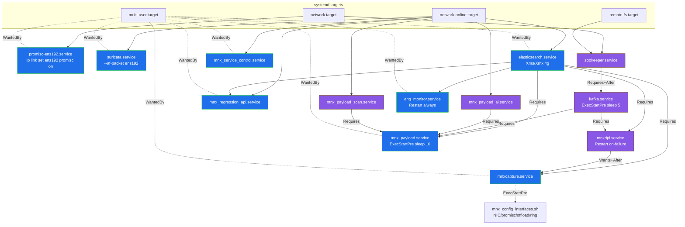
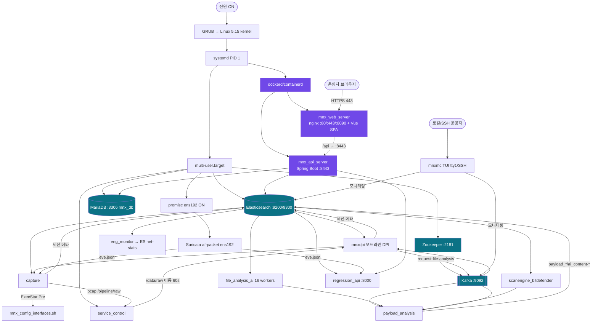

# Phase 2 — 전체 실행 흐름 / 부팅 순서 (Boot & Startup Sequence)

> 근거: `/etc/systemd/system/*.service`, `/lib/systemd/system/suricata.service`의 `After/Requires/Wants/ExecStartPre` 지시자 실측 + `_research/00_runtime_snapshot.md`, `_research/08_infra_boot.md`.
> 모든 의존 엣지는 아래 유닛 지시자에서 직접 도출. 컨테이너 기동은 systemd 밖 트랙이며 근거가 간접적인 부분은 **(추정)**.

---

## 1. systemd enable 그래프의 핵심 원리

**enable(부팅 자동기동) 유닛 = 8개**:
`elasticsearch`, `mnxcapture`, `mnx_payload`, `mnx_regression_api`, `mnx_service_control`, `eng_monitor`, `promisc-ens192`, `suricata`.

**disabled 이지만 실제 기동되는 유닛 = 5개**:
`zookeeper`, `kafka`, `mnxdpi`, `mnx_payload_ai`, `mnx_payload_scan`.
→ 이들은 `WantedBy`(enable)로 켜지는 것이 아니라, **enable된 유닛의 `Requires=`/`Wants=`로 끌려 들어와 기동**된다.

끌어들이는 관계(실측):
- `mnxcapture` → `Wants=mnxdpi` → `mnxdpi` `Requires=kafka,elasticsearch` → `kafka` `Requires=zookeeper`
- `mnx_payload` → `Requires=mnx_payload_ai, mnx_payload_scan, kafka, elasticsearch`

> **운영 함의:** `systemctl disable`되어 있어도 상위 유닛 때문에 뜨므로 "꺼짐"으로 착각하기 쉽다. 반대로 `mnxcapture`/`mnx_payload`를 stop하면 하위가 자동으로 멈추지 않을 수 있다(참조는 `Wants`/`Requires`의 역방향 전파 규칙에 따름). 상세 정지 순서는 Phase 12.

---

## 2. 부팅 의존성 다이어그램 (systemd)

(파랑 = enable 유닛, 보라 = Requires/Wants로 끌려온 유닛)

---

## 3. 전체 기동 순서 다이어그램 (부팅→서비스→Docker→프로세스→파이프라인→UI)

사용자 요구 순서(부팅→systemd→서비스→Docker→프로세스→API→Web→Capture→Parser→Kafka→ES→UI)를 실제 구조에 매핑:

---

## 4. 기동 타임라인(순서 근거표)

| 단계 | 유닛/프로세스 | 선행 조건(실측 지시자) | 지연 | 비고 |
|---|---|---|---|---|
| 0 | 커널→systemd→`multi-user.target` | — | — | |
| 1 | `promisc-ens192` | `After=network.target` | — | 캡처 NIC promisc ON |
| 1 | `suricata` | `Requires/After=network-online` | — | af-packet 라이브 스니핑 시작 |
| 1 | `elasticsearch` | `Wants/After=network-online` | JVM 기동 수~수십초 | 모든 저장의 기반 |
| 1 | `zookeeper` | `Requires/After=network+remote-fs` | — | kafka 선행 |
| 2 | `kafka` | `Requires/After=zookeeper` | `ExecStartPre sleep 5` | |
| 3 | `mnxdpi` | `Requires ES + kafka` | `Restart on-failure/5s` | mnxcapture가 `Wants` |
| 4 | `mnxcapture` | `Requires ES`, `Wants/After mnxdpi` | `ExecStartPre` NIC 설정 | 캡처 시작 |
| 4 | `mnx_service_control` | `After=network-online` | — | 모듈 감독 시작 |
| 4 | `mnx_regression_api` | `After=network-online, ES` | — | :8000 오픈 |
| 4 | `mnx_payload_ai` | `After=network-online` | — | 16워커 소켓 바인드 |
| 4 | `mnx_payload_scan` | `After=network-online` | — | AV 소켓 바인드 |
| 4 | `eng_monitor` | `Requires/After ES` | `Restart always` | net-stats 수집 |
| 5 | `mnx_payload` | `Requires ES+kafka+ai+scan` | `ExecStartPre sleep 10` | 소켓/버스 워밍업 후 |
| D | `dockerd`→`mnx_api_server`,`mnx_web_server` | systemd 밖, 컨테이너 `restart` 정책 | — | 배포는 `docker_run_{1g,10g}.sh`/compose (추정) |

> `sleep 5`(kafka)/`sleep 10`(payload)은 **의존 대상의 소켓 바인드 완료를 기다리는 임의 워밍업 지연**이다. 하드 헬스체크가 아니므로 느린 부팅에서는 여전히 경합 가능(Phase 12 리스크).

---

## 5. Docker 컨테이너 기동 트랙

- 두 컨테이너(`mnx_api_server`, `mnx_web_server`)는 **systemd 유닛이 아니라** dockerd/containerd가 관리한다. `docker network=host`로 호스트 포트에 직접 바인딩(80/443/8090/8443).
- 배포/재기동은 `/data/tools/docker_run_1g.sh` 또는 `docker_run_10g.sh` + `/opt/mnx_web/docker-compose-{api,web}-{1g,10g}.yml`로 수행(트래픽 프로파일 택1). **(추정)** compose의 `restart` 정책 또는 dockerd `--restart` 로 부팅 시 자동 복구.
- **부팅 경합 리스크:** API 컨테이너는 호스트 MariaDB(:3306)·ES(:9200)에 의존하나, systemd 순서와 무관하게 뜨므로 **ES/MariaDB보다 먼저 기동되면 초기 연결 실패 후 재시도**에 의존(Spring Hikari 재연결). Phase 11·12에서 상술.

---

## 6. 부팅 시 관찰된 실제 상태(2026-07-10)

- 13개 MNX 관련 유닛이 모두 `active` (enable 8 + pulled 5). 근거: `_research/00_runtime_snapshot.md` "MNX systemd unit states".
- 단, `mnxcapture`는 **기동은 되었으나 기능적으로 stall**(ES flood-stage 블록으로 시퀀스번호 획득 무한 재시도). → 부팅 성공 ≠ 데이터 흐름 정상. 이 괴리를 인수자가 반드시 인지해야 함.
- 컨테이너 2개 `Up`(2개월). 재부팅 생존은 **미검증**(현 인스턴스는 장기 가동 중).

---

## 7. 인수인계 체크포인트

1. `systemctl list-dependencies multi-user.target | grep -E 'mnx|kafka|zookeeper|elastic|suricata'`로 실제 pull-in 확인.
2. 재부팅 시 **Docker 컨테이너 자동기동 여부**를 반드시 검증(현재 근거 간접적).
3. `mnxdpi`/`payload_ai`/`payload_scan`는 disabled이므로, 상위 유닛(`mnxcapture`/`mnx_payload`) 없이 단독 재부팅 테스트 시 누락될 수 있음.
4. `sleep` 기반 워밍업의 한계 — 대체로 헬스체크/`ExecStartPre` 조건화 권장(Phase 15).
