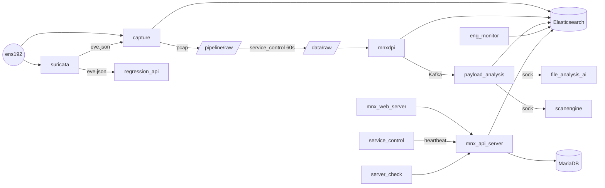

# Phase 3 — 전체 프로세스 분석 (Process Inventory)

> 근거: 실측 `ps -eo`, `ss -tlnp`, `systemctl`, crontab, 각 유닛 파일 + `_research/01~08`.
> 각 프로세스: 역할 / 실행파일 / 실행옵션 / 환경변수 / 설정파일 / 입력 / 출력 / 로그 / 장애영향.

---

## 1. 상시 데몬 (systemd 관리)

### 1.1 요약표

| # | 프로세스 | 실행파일 | 옵션 | 설정파일 | 입력 | 출력 | 로그 | 사용자 |
|---|---|---|---|---|---|---|---|---|
| 1 | **capture** | `/opt/mnx/bin/capture` | `-c config.ini` (`${OPTIONS}` 빈값) | `/opt/mnx/etc/config.ini` | ens192 라이브 패킷 | pcap→`/pipeline/raw`(→`/data/raw`), ES 세션 `mnx_sessions3-*` | `/logs/mnxcapture/capture.log` | **nobody** |
| 2 | **mnxdpi** | `/opt/mnxdpi/mnxdpi` | `-c mnx_config.json -s`(시작) / `-K`(정지) | `/opt/mnx/etc/mnx_config.json` | `/data/raw` pcap 파일 | ES 세션 `mnx_sessions3`, Kafka `request-file-analysis`, payload→`/data/payload` | `/logs/mnxdpi/` | root |
| 3 | **suricata** | `/usr/bin/suricata` | `--af-packet -c suricata.yaml --pidfile /run/suricata.pid --user suricata` | `/etc/suricata/suricata.yaml` + `/application/custom-rule/suricata` | ens192 라이브 패킷 | `/logs/suricata/eve.json`(alert), `fast.log`, `stats.log` | `/logs/suricata/` | suricata |
| 4 | **payload_analysis** | `/opt/payload_analysis/payload_analysis` | `-d -c mnx_config.json` | mnx_config.json + `file_type.yar` | Kafka `request-file-analysis`, `/data/payload/*` | ES `payload_*`/`ai_content-*`/`mail_content-*`, UNIX소켓 요청 | `/logs/payload_analysis/` | root |
| 5 | **file_analysis_ai** | `python3.12 file_analysis_ai.py` | `--config mnx_config.json start` | mnx_config.json + `settings.py` | UNIX소켓 `/var/run/payload_ai_analysis.sock` `{file_type,file_path}` | `{label,score}` (소켓 응답) | `/logs/payload_ai_analysis/` | root |
| 6 | **scanengine_bitdefender** | `/opt/scanengine/scanengine_bitdefender` | `-d -c mnx_config.json` | mnx_config.json + `pattern_path.conf` | UNIX소켓 `/var/run/payload_scanengine.sock` | AV 판정(소켓 응답) | `/logs/payload_scanengine/` | root |
| 7 | **service_control** | `/opt/service_control/service_control` | `-d -c mnx_config.json` | mnx_config.json | UNIX소켓 `/var/run/service_control.sock`, systemctl | 모듈 start/stop, 웹(:8443) heartbeat/patch/version, `/pipeline/raw→/data/raw` | `/logs/service_control/` | root |
| 8 | **regression_api** | `python3.12 /opt/regression_api/app.py` | `mnx_config.json` (인자) | mnx_config.json + `config.py` | HTTP :8000, `/logs/suricata/eve.json`, 저장 pcap | ES `mnx_sessions3-*` enrich, Suricata 재실행 결과 | `/opt/regression_api`(logger.py) | root |
| 9 | **eng_monitor** | `/data/tools/eng_monitor.sh` | — | 스크립트 내 하드코딩(ens192, Net-1) | ens192 `/sys/class/net` 카운터 | ES `net-stats-YYYYMM` | `/logs/eng_monitor/` | root |
| 10 | **elasticsearch** | `.../bin/systemd-entrypoint` | `-p PID --quiet` | `/etc/elasticsearch/` | HTTP :9200, transport :9300 | 인덱스 저장(디스크) | `/var/log/elasticsearch/` | elasticsearch |
| 11 | **kafka** | `kafka-server-start.sh` | `server.properties` | `/usr/local/kafka/config/server.properties` | producer(:9092) | 토픽 로그(`/logs/kafka`) | `/logs/kafka`, `/usr/local/kafka/logs` | root |
| 12 | **zookeeper** | `zookeeper-server-start.sh` | `zookeeper.properties` | `.../config/zookeeper.properties` | :2181 | kafka 메타데이터 | `/usr/local/kafka/logs` | root |
| 13 | **mariadbd** | `/usr/sbin/mariadbd` | (기본) | `/etc/mysql/` | :3306(localhost) | `/var/lib/mysql/mnx_db` | `/var/log/mysql` | mysql |

### 1.2 컨테이너 프로세스 (dockerd 관리, network=host)

| # | 프로세스 | 이미지 | 실행옵션 | 리슨 | 입력 | 출력 | 장애영향 |
|---|---|---|---|---|---|---|---|
| 14 | **mnx_api_server** | `mnx-api-v23:v23.5.1.2` | `/__cacert_entrypoint…` `app.jar -Xmx80g` | :8443 HTTPS | 브라우저/웹, regression_api(:8000) | MariaDB `mnx_db`, ES :9200 | UI·외부연동·조회 전면 중단 |
| 15 | **mnx_web_server** | `mnx-web-v23:v23.5.1.2` | `/entrypoint.sh --traffic …` | :80/:443/:8090 | 운영자 브라우저 | 정적 Vue SPA, `/api`→:8443 프록시 | 사용자 접속 불가(API는 살아있음) |

---

## 2. 스케줄(cron) 프로세스

| 프로세스 | 스케줄 | 명령 | 입력 | 출력 | 비고 |
|---|---|---|---|---|---|
| **server_check.py** | 매분 ×2 (0s, 30s) → 사실상 30초 | `python3.12 server_check.py --cpu_interval 5 --hdd_path /data` | psutil(CPU/mem/disk) | 웹 `POST /api/server/status/save` → `server_status_tbl` | 무한 증가 테이블(230k행) |
| **syslog.py** | 매 5분 | `python3.12 syslog.py --config mnx_config.json` | 웹 탐지(+ES 세션) | 외부 syslog(RFC6587/TLS/UDP) | **inert**: 모든 서버 `enable:false` → 조기 종료 |
| **pcap_delete.py** | 매 10분 | `python3 /data/tools/pcap_delete.py` | `/data/raw` 파일목록 | `/data/raw`≥80% 시 오래된 순 삭제(+`/pipeline/raw` 심링크) | 실패 시 `/data` 100% 위험 |
| **payload_delete.sh** | 03:30 (**중복 2회**) | `/data/tools/payload_delete.sh` | `/data/payload/*` | `RETENTION_DAY=1` 초과 폴더 삭제 | crontab 중복 등록 결함 |
| **updater_bitdefender** | 4시간 | `/opt/scanengine/updater_bitdefender` | BitDefender 업데이트 서버 | `Update1/Update2` 시그니처 갱신 | 외부망 필요 |
| **update_mitre_attack.sh** | 01:00 | `/application/mnx_web/mitre_attack/update_mitre_attack.sh` | MITRE CTI(외부) | `mitre_attack.json` 원자적 교체 | 외부망 필요 |
| **logrotate(mnx)** | 매 30분 | `/usr/sbin/logrotate /etc/logrotate.d/mnx` | `/logs/*` | 회전(daily+100M, **rotate 1**) | 세대 1개만 유지 → 유실 위험 |

---

## 3. 부팅/온디맨드 프로세스

| 프로세스 | 트리거 | 실행파일 | 역할 |
|---|---|---|---|
| **mnx_config_interfaces.sh** | `mnxcapture` ExecStartPre | `/opt/mnx/bin/mnx_config_interfaces.sh -c config.ini -n default` | ens192 promisc/offload off/ring 4096 설정 |
| **promisc-ens192** | 부팅 | `ip link set ens192 promisc on` | 캡처 NIC promisc |
| **mnxmc 콘솔** | tty1 로그인 / SSH | `python3.12 /mnxmc/main-login.py` (또는 `main.py`) | 관리 TUI (pid 4020 실행중) |
| **MNX_all_start/stop_service.sh** | 운영자 수동 | `/data/tools/*` | 전체 서비스 일괄 제어 |

---

## 4. 핵심 프로세스 상세 (장애 영향 중심)

### 4.1 capture (네이티브 5.8.2) — 데이터 플레인 원천
- **옵션 특이점:** `capture.env` 파일 부재 → `${OPTIONS}` 빈값. 즉 튜닝 옵션(스레드/필터 override) **미적용**.
- **입력→출력:** ens192(promisc, TPACKET_V3, 2 packet threads, ring 4096, BPF `not broadcast and not multicast`) → pcap `/pipeline/raw`(심링크; 실제 바이트 `/data/raw`, 3GB 파일) + ES 세션 `mnx_sessions3-YYMMDD`(시퀀스 `mnx_sequence_v30`).
- **장애영향:** 죽거나 stall 시 **전 NDR가 실명**. 세션·pcap 신규 생성 중단 → mnxdpi/payload 체인 전부 아사(starvation). 현재 실제 stall 상태(ES 읽기전용 블록 → 무한 재시도, crash 없어 systemd 재시작도 안 됨).
- **로그 위험:** stall 재시도 로그가 `/logs/mnxcapture` 8.4GB 축적.

### 4.2 mnxdpi — 오프라인 DPI
- PACE2(ipoque)+PcapPlusPlus 임베드, `mode=direct`, `exclusive_read=true`, 내부 워크아이템 `pcapfile_work_item`.
- **입력:** `/data/raw` pcap(service_control이 `/pipeline/raw`에서 60초마다 이동). **출력:** ES 세션 + Kafka `request-file-analysis` + `/data/payload` carving.
- **장애영향:** 죽으면 세션 심층분류·payload 추출 중단 → 파일분석(AI/AV) 아사. `Restart=on-failure/5s`로 자동 복구 대상(단 disabled라 단독 재부팅 누락 위험).

### 4.3 service_control — 오케스트레이터 겸 스테이저
- 모듈 수명주기 제어 + `/pipeline/raw→/data/raw` 이동(60s) + 웹 heartbeat.
- **장애영향:** 죽으면 (1) pcap이 `/pipeline`에 정체되어 mnxdpi 입력 끊김, (2) 웹 대시보드 서버상태/버전 갱신 중단. 유닛에 `TimeoutStopSec=infinity`+`SendSIGKILL=no` → **정지 시 hang하면 영구 대기**(운영 위험).

### 4.4 mnx_api_server (Spring Boot) — 조회/제어 게이트웨이
- `app.jar`, `-Xmx80g`(대용량 힙), MariaDB(Hikari 300)+ES. 244 엔드포인트/37 컨트롤러.
- **장애영향:** UI 전 기능·외부 API·서버상태 수집(`/api/server/status/save`)·syslog 소스 중단. 캡처/탐지(데이터 플레인)는 계속되나 **가시성 상실**.

---

## 5. 프로세스 관계 요약도

---

## 6. 장애 영향 등급 (프로세스별)

| 등급 | 프로세스 | 죽었을 때 |
|---|---|---|
| 🔴 치명 | capture, elasticsearch | NDR 데이터 수집/조회 전면 마비 |
| 🔴 치명 | mnx_api_server, mnx_web_server | UI/외부연동 전면 중단(데이터 플레인은 지속) |
| 🟠 높음 | mnxdpi, service_control, kafka, mariadb | 분석체인/오케스트레이션/버스/관계형 상태 중단 |
| 🟡 중간 | payload_analysis, file_analysis_ai, scanengine, suricata | 위협 심층분석/IDS 알럿 부분 손실 |
| 🟢 낮음 | regression_api, eng_monitor, server_check, syslog, cron류 | 부가 기능(재검증/모니터/보존) 저하, 코어 영향 적음 |

> 장애 전파·복구·재시작 순서 상세는 **Phase 12(장애 분석)**.
