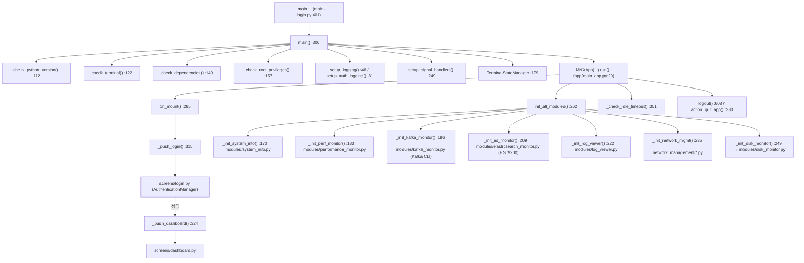
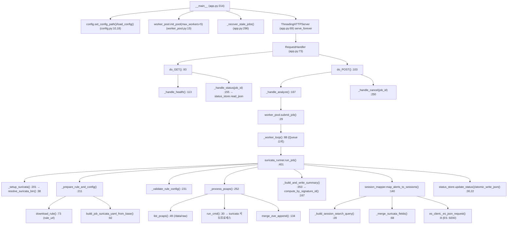
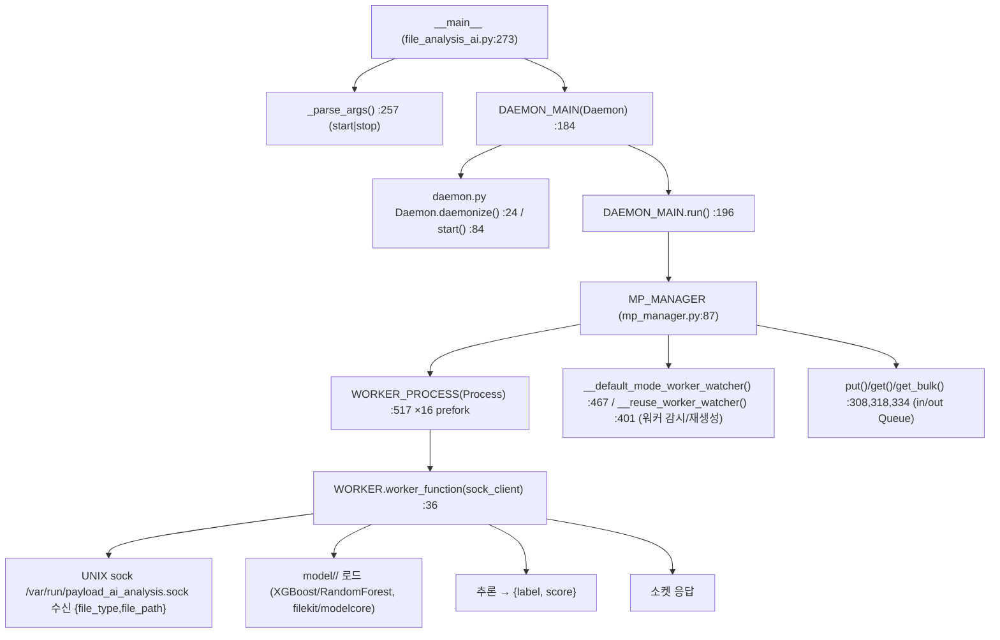
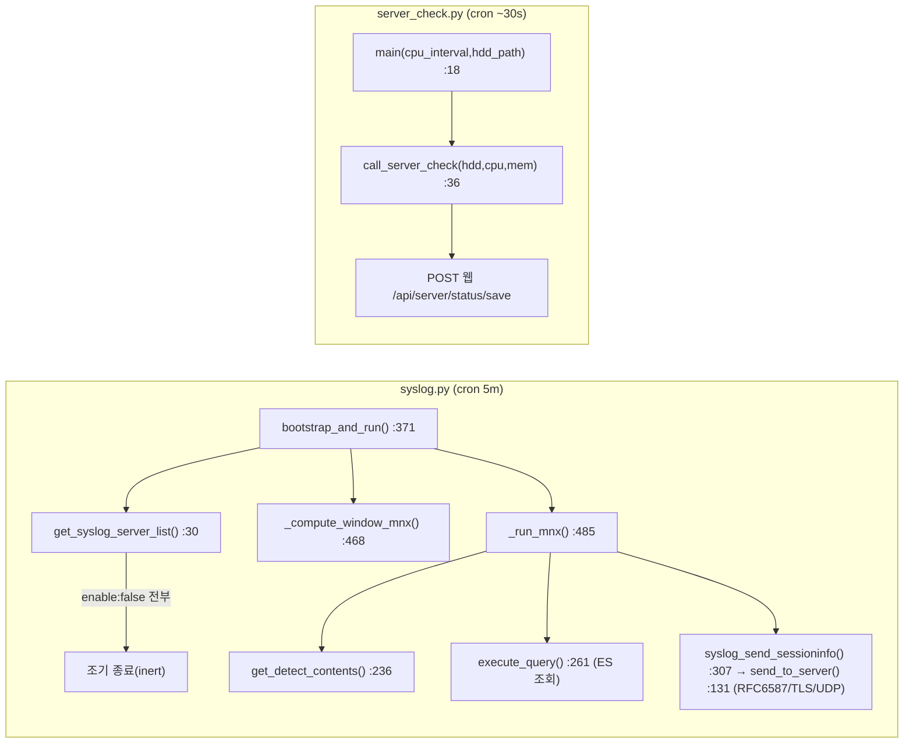
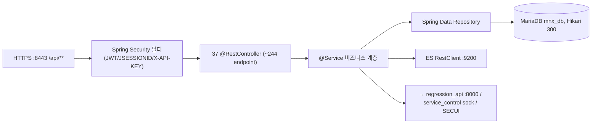

# Phase 4 — 소스 콜 그래프 (Source Call Graph)

> 근거: Python 소스는 `grep -n 'def/class'` 실측(파일:라인 인용). C/C++ 바이너리(capture/mnxdpi/payload_analysis/scanengine/service_control)는 stripped ELF이므로 **함수 단위 정적 콜그래프 추출 불가** → `strings`/설정/런타임 동작 기반의 **모듈·흐름 수준** 그래프로 대체하며 **(추정)** 표기.

---

## 1. mnxmc 콘솔 (Python/Textual) — 실측 콜 그래프

`main-login.py` 진입점 흐름 (`main-login.py:306` `main()`):

**화면(screens) → 모듈 매핑** (`app/screens/`):

| Screen | 대응 모듈/동작 | 외부 접근 |
|---|---|---|
| `login.py` | 자체 `AuthenticationManager`(PAM/`spwd`/`crypt`) | 로컬 계정 |
| `service.py` | 서비스 상태/제어(자체 인증 재구현) | `systemctl`, service_control |
| `dashboard.py` | 종합 상태 | — |
| `elasticsearch.py` | `modules/elasticsearch_monitor` | ES :9200 |
| `kafka.py` | `modules/kafka_monitor` | Kafka CLI :9092 |
| `performance.py`/`system.py`/`logs.py`/`network.py`/`firewall.py`/`mnx_config.py`/`shell.py` | 각 modules/* | psutil, netplan, iptables, `/bin/bash` |

> ⚠ `utils/auth.py`의 `AuthenticationManager`는 **미사용**(dead). 실제 인증은 `login.py`·`service.py`가 각기 재구현(3중 중복). `login.py:102`/`service.py:51`가 Python 3.13 제거 예정 `spwd`/`crypt` 직접 사용 → 업그레이드 시 로그인 붕괴 위험.

---

## 2. regression_api (Python http.server) — 실측 콜 그래프

`app.py:314` `__main__` → HTTP 요청 처리 흐름:

**외부 의존:** `suricata`(서브프로세스), Elasticsearch(`mnx_sessions3-*` 조회/갱신), 파일시스템(`/data/raw` pcap, job 산출물).

---

## 3. file_analysis_ai (Python 멀티프로세스) — 실측 콜 그래프

**IPC:** `MP_MANAGER`가 `multiprocessing.Queue`(in/out) + 워커 프로세스 풀 관리. 외부 인터페이스는 UNIX 소켓. **호출자:** `payload_analysis`(C++).

---

## 4. syslog.py / server_check.py (cron) — 실측 콜 그래프

---

## 5. C/C++ 데이터 플레인 (모듈·흐름 수준, 추정)

바이너리는 stripped이므로 함수 심볼 기반 콜그래프 없음. `strings`/설정/런타임 동작으로부터 도출한 **흐름 콜그래프**:

```mermaid
flowchart TD
    subgraph capture["capture (네이티브 C)"]
      CMAIN["main → config.ini 로드"] --> RDR["packet reader(TPACKET_V3, 2 threads)"]
      RDR --> PARSE["parser .so ×47 (dns/http/tls/...)"]
      RDR --> WRITER["pcap writer → /pipeline/raw"]
      PARSE --> ESIDX["mnx_db_* → ES /_bulk (mnx_sessions3)"]
      ESIDX -.현재 stall.-> SEQ["mnx_db_get_sequence_number_sync (무한 재시도)"]
      PARSE --> PLUG["plugins: suricata.so(eve.json), libmnxdpi.so(선언, 미로드 추정)"]
    end
    subgraph dpi["mnxdpi (C++, PACE2+PcapPlusPlus)"]
      DMAIN["main(-c json -s)"] --> WI["pcapfile_work_item (mode=direct)"]
      WI --> CLASS["_MNX_SESSION_PROCESS 분류"]
      CLASS --> DES["ES /_bulk (mnx_sessions3)"]
      CLASS --> DKAF["Kafka produce (request-file-analysis)"]
      CLASS --> CARVE["payload carving → /data/payload"]
    end
    subgraph pay["payload_analysis (C++)"]
      PMAIN["main(-d -c json)"] --> KCON["Kafka consume (group mnx)"]
      KCON --> YARA["YARA file_type.yar 타이핑"]
      YARA --> FANOUT["UNIX sock 팬아웃"]
      FANOUT --> AISOCK["→ file_analysis_ai.sock"]
      FANOUT --> AVSOCK["→ scanengine.sock"]
      FANOUT --> PES["ES payload_*/ai_content-*/mail_content-*"]
    end
    subgraph sc["service_control (C++)"]
      SMAIN["main(-d -c json)"] --> CTLSOCK["UNIX sock /var/run/service_control.sock"]
      SMAIN --> MOVE["/pipeline/raw → /data/raw (60s)"]
      SMAIN --> HB["heartbeat/patch/version → 웹 :8443"]
      SMAIN --> SYSCTL["systemctl 모듈 제어"]
    end
```

> 정밀 함수 콜그래프가 필요하면 `mnxdpi.debug`(디버그심볼) 또는 원본 소스 저장소가 있어야 함(어플라이언스에는 소스 부재). **인수인계 시 빌드 저장소 확보 필요**.

---

## 6. Spring Boot API (Java) — 아키텍처 콜 계층 (추정, 디컴파일 근거)

세부 엔드포인트·인증은 **Phase 6(REST API)**, 테이블 매핑은 **Phase 7(DB)** 참조.

---

## 7. 진입점 총괄표

| 컴포넌트 | 진입점(파일:라인) | 런타임 형태 |
|---|---|---|
| 콘솔 | `main-login.py:306 main()` / `main.py` | Textual App |
| regression_api | `app.py:314 __main__` | ThreadingHTTPServer + 5 proc pool |
| file_analysis_ai | `file_analysis_ai.py:273 __main__` | Daemon + 16 worker proc |
| syslog | `syslog.py:371 bootstrap_and_run()` | cron oneshot |
| server_check | `server_check.py:18 main()` | cron oneshot |
| capture | `main`(C, 네이티브) | 네이티브 데몬 |
| mnxdpi | `main`(C++) | 네이티브 데몬 |
| payload_analysis | `main`(C++) | 네이티브 데몬 |
| service_control | `main`(C++) | 네이티브 데몬 |
| API | Spring Boot `app.jar` | JVM |
