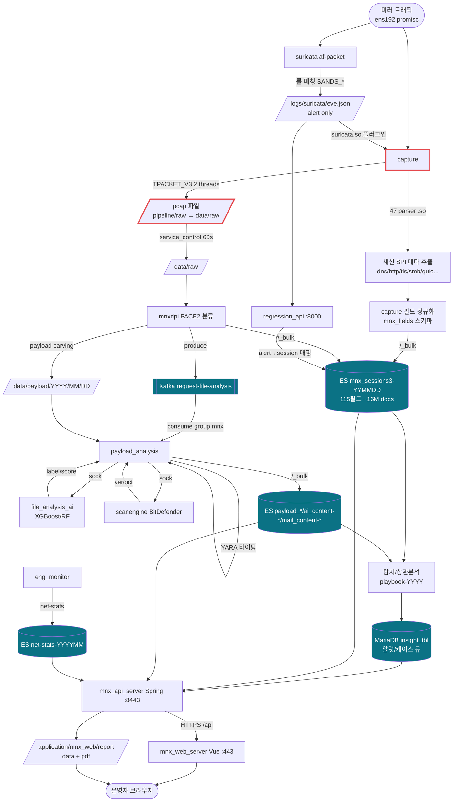
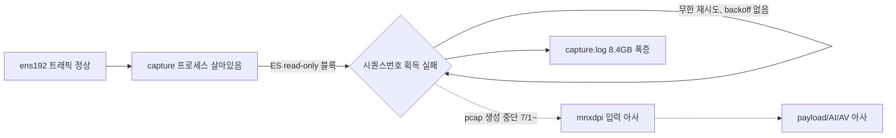

# Phase 5 — 데이터 흐름 (Data Flow)

> Packet → Capture → Parser → Normalization → Detection → Kafka → Elasticsearch → UI → Report.
> 근거: `_research/02(capture)`, `03(dpi/suricata)`, `04(payload/ai/scan)`, `05(web/api)`, `07(datastores)`.

---

## 1. 종단간 데이터 흐름 다이어그램

(빨강 테두리 = 현재 stall 구간: capture→pcap 생성이 7/1 이후 멈춤)

---

## 2. 단계별 데이터 명세

| 단계 | 생산자 | 데이터 형태 | 위치/토픽/인덱스 | 소비자 | 정규화/스키마 |
|---|---|---|---|---|---|
| 1. Packet | 네트워크 TAP/SPAN | L2~L7 원시 프레임 | ens192(promisc) | capture, suricata | — |
| 2. Capture(pcap) | capture | pcap 파일(3GB 단위) | `/pipeline/raw`(심링크)→`/data/raw` | mnxdpi, regression_api | 네이티브 pcap 포맷 |
| 3. Parse/SPI | capture 47 파서 | 세션 메타(SPI) | in-memory | 정규화 단계 | 프로토콜별 필드 |
| 4. Normalize | capture | 정규화 세션 문서 | `mnx_fields` 스키마 | ES 색인 | 115필드 통일 |
| 5. Detection(IDS) | suricata | alert 이벤트 | `/logs/suricata/eve.json` | suricata.so, regression_api | eve JSON |
| 6. DPI 분류 | mnxdpi | 심층 세션 + 파일작업 | ES + Kafka + `/data/payload` | ES, payload_analysis | PACE2 분류 결과 |
| 7. Kafka | mnxdpi | 파일분석 작업 메시지 | 토픽 `request-file-analysis` (RF=1, 7일) | payload_analysis(group mnx) | JSON 메시지 |
| 8. File 분석 | payload_analysis+AI+AV | md5/sha/yara/av/ai label·score | ES `payload_*`,`ai_content-*`,`mail_content-*` | API | payload 스키마 |
| 9. 상관/케이스 | API(Spring) | 인사이트/케이스/플레이북 | MariaDB `insight_*`, ES `playbook-YYYY` | API/UI | 관계형 + logical idx |
| 10. UI | API→Web | REST/JSON | HTTPS :8443→:443 | 브라우저 | API DTO |
| 11. Report | API | PDF/데이터 | `/application/mnx_web/report/{data,pdf}` | 운영자/다운로드 | 리포트 템플릿 |

---

## 3. 두 개의 독립 캡처 경로 (중요)

`ens192`는 **capture와 suricata가 각각 독립적으로 스니핑**한다(단일 파이프라인이 아님).

- **capture 경로:** 라이브 → pcap + 전체 세션 메타(양적 가시성). pcap은 mnxdpi의 오프라인 입력이 됨.
- **suricata 경로:** 라이브 → 룰 기반 alert(질적 탐지). eve.json으로만 출력, Kafka/ES 직접 출력 없음.
- **합류 지점:** (1) capture의 `suricata.so` 플러그인이 eve.json alert를 세션에 결합, (2) `regression_api`가 alert↔세션 매핑(`session_mapper.map_alerts_to_sessions`).

> eve.json → ES alert 인덱스로의 정확한 브리지는 `suricata.so` 플러그인 경유로 **추정**(datastore 에이전트 미확정). 인수 시 실제 alert 색인 경로를 `suricata.so` 동작으로 확정 필요.

---

## 4. 정규화(Normalization) 상세

- **capture `mnx_fields`**: 47개 파서가 추출한 프로토콜별 필드를 통일된 115필드 세션 문서로 매핑(`mnx_sessions3-YYMMDD`). 시퀀스는 `mnx_sequence_v30`으로 발급.
- **mnxdpi**: PACE2 애플리케이션 분류 결과를 동일 `mnx_sessions3` 인덱스에 병합(세션 enrich).
- **payload 정규화**: 파일 해시(md5/sha), YARA 매치, AV 판정, AI label/score를 `payload_YYMM` 문서로 표준화. LLM 대화는 `ai_content-*`, 메일은 `mail_content-*`.

---

## 5. 보존(Retention) 흐름

| 데이터 | 보존 메커니즘 | 임계/주기 |
|---|---|---|
| pcap `/data/raw` | `pcap_delete.py` (cron 10m) | FS ≥80% 시 오래된 순 삭제 |
| payload `/data/payload` | `payload_delete.sh` (cron 03:30) | `RETENTION_DAY=1` |
| ES `mnx_sessions3-*` | capture `rotateIndex=daily` + 앱 purge | 일 단위 인덱스 |
| Kafka `request-file-analysis` | 브로커 retention | 7일 |
| 로그 `/logs/*` | logrotate(mnx) cron 30m | daily+100M, **rotate 1** |
| ES ILM | **없음**(스톡 정책 미사용) | — |

---

## 6. 현재 데이터 흐름 상태(2026-07-10) — 장애 구간

- **근본 원인:** ES 디스크 flood-stage(`/application` 91%, ES 여유 1.8GB) → 인덱스 `read-only-allow-delete` → capture가 신규 세션/시퀀스 색인 불가 → 무한 재시도.
- **연쇄:** pcap 미생성 → mnxdpi `submitted=0`/`active_pcap_group=0` idle → payload 체인 전체 무입력.
- **복구:** ES 디스크 확보 → `read-only-allow-delete` 해제 → capture 재시작. 상세는 Phase 12·13.

---

## 7. 인수인계 핵심 포인트

1. **데이터 원천은 capture 단일 지점** — 여기 막히면 전 체인 아사. 모니터링 1순위.
2. **pcap은 2번 이동**한다: capture가 `/pipeline/raw`에 쓰고 service_control이 `/data/raw`로 옮긴 뒤 mnxdpi가 읽음. `/pipeline` 또는 `/data` 어느 쪽이 막혀도 흐름 정지.
3. **Kafka는 단일 토픽·단일 소비자**(RF=1). 브로커 장애 시 파일분석만 끊기고 세션 색인은 지속.
4. **UI 데이터는 ES + MariaDB 이원화** — 세션/알럿=ES, 케이스/설정/플레이북=MariaDB. 조회 성능·정합성 이슈는 두 저장소를 함께 봐야 함.
