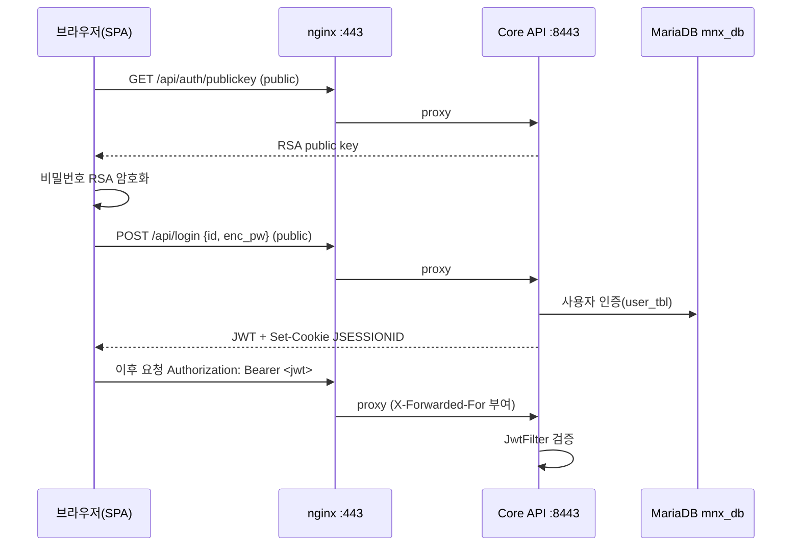
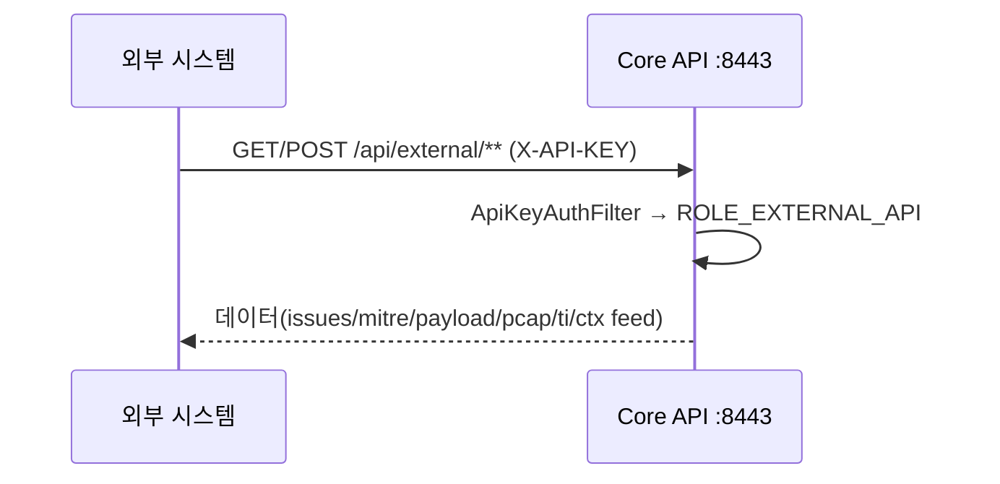

# Phase 6 — REST API 분석

> 근거: `_research/05_web_api_docker.md`(컨테이너 디컴파일 `javap -v`로 37 컨트롤러/~244 엔드포인트 추출) + `regression_api` 소스 실측 + nginx conf.
> **정정:** API는 FastAPI가 아니라 **Spring Boot(Java 17)**. Python REST는 별도 호스트 서비스 `regression_api`(:8000) 뿐.

---

## 1. API 계층 구조 (2개의 REST 서비스)

| API | 스택 | 리슨 | 노출 | 인증 | 호출 주체 |
|---|---|---|---|---|---|
| **Core API** | Spring Boot / Java 17 (`app.jar`) | `:8443` HTTPS(`*`) | nginx `/api`→8443 | JWT + 세션 + X-API-KEY | 브라우저(SPA), 외부 파트너 |
| **regression_api** | Python `http.server` | `:8000` HTTP(0.0.0.0) | 미프록시(내부 전용) | **없음(무인증)** | Core API가 서버-투-서버 호출 |

nginx 라우팅(웹 컨테이너 내부):
```
80  → 301 https
443 /       → https://127.0.0.1:8090 (Vue SPA)
443 /api    → https://127.0.0.1:8443 (Core API, 스트리밍 튜닝)
443 /mnx/api→ http://127.0.0.1:8005  (리스너 없음 — dead route, CORS *)
8090 /      → 정적 SPA
```

---

## 2. 인증 모델 (Spring Security)

- **하이브리드**: JWT Bearer 토큰 **와** 서블릿 세션(`JSESSIONID`, http-only/secure/same-site=none, 30분)이 `HybridSecurityContextRepository`로 공존.
- **JWT**: `Authorization: Bearer <token>`, HS 서명키 `jwt.secret`(yml 하드코딩). `JwtFilter`가 매 요청 검증. `GET /api/auth/refresh`로 갱신.
- **API 키**: `X-API-KEY` 또는 `Authorization: Bearer` → `ApiKeyAuthFilter` → `ROLE_EXTERNAL_API`. 키 저장 `/application/mnx_web/apikey/`. `/api/external/**`, `/api/ctx/**` 전용.
- **역할**: `ROOT`, `SUPER_ADMIN`, `ADMIN`, `MANAGER`, `EXTERNAL_API`.
- 🔴 **치명 보안결함**: `jwt.secret`이 **공개된 튜토리얼 문자열**("silvernine-tech…") → **누구나 유효 JWT 위조 가능**. `JASYPT_PASSWORD=Toswm#0501`이 compose에 평문 → 모든 `ENC()` 자격증명 복호화 무력화. TLS 인증서는 self-signed 데모, **2024-10-15 만료**.

### 로그인 호출 순서


### 외부 파트너 호출 순서


---

## 3. Core API 엔드포인트 카탈로그 (37 컨트롤러 / ~244)

Base context `/api`. `공개`=permitAll, `인증`=JWT/세션, `apikey`=X-API-KEY.

| 컨트롤러 | Base | 수 | 인증 | 주요 라우트 / 용도 |
|---|---|---|---|---|
| CommonController | `/api` | 1 | 공개 | `GET /hostname` |
| AuthController | `/api/auth` | 2 | 혼합 | `GET /publickey`(공개, RSA), `GET /refresh` |
| LoginController | `/api/login` | 1 | 공개 | `POST /` 로그인→JWT |
| UserController | `/api/user` | 8 | 인증 | `POST list/save`, `POST root/save`(공개 부트스트랩), `GET me`, `POST id-check`, `GET detail/{idx}`, `POST delete/{idx}` |
| AuditController | `/api/audit` | 2 | 인증 | `POST list`, `GET menu` |
| BackupController | `/api/backup` | 6 | 인증 | `POST /execute`, `GET /status|/history`, `GET /file/download/{idx}` |
| RestoreController | `/api/restore` | 5 | 인증 | `POST /environment/{idx}`, `POST /environment/file/upload`, `GET /status` |
| DashboardController | `/api/dashboard` | 2 | 인증 | `GET /stat-all/{nif}`, `POST /3d/chart/{nif}` |
| MonitorController | `/api/monitor` | 1 | 인증 | `GET stat-all/{nif}` |
| DetectController | `/api/detect` | 13 | 인증 | snort/suricata/yara 룰 CRUD·검증 (`POST /rule/save`, `POST /suricata/rule/save/multi`, `PUT/DELETE /suricata/rule/{idx}`) |
| InsightController | `/api/insight` | 27 | 인증 | 이슈/시나리오/플레이북/MITRE/LLM (`POST /list`, `PUT /issue/status`, `POST /scenario`, `POST /playbook`, `POST /temp/llm/test`) |
| InsightAssetController | `/api/insight/asset` | 12 | 인증 | 자산/디바이스/IP 클러스터 (`POST /ipv4/list`, `POST /cluster/device/list/{nif}`) |
| BlackboxController | `/api/blackbox` | 10 | 인증 | 일별 탐지통계, `GET /file/download`, `GET /sid/contents/{sid}` |
| StatController | `/api/stat` | 14 | 인증 | 트래픽/앱/프로토콜/파일/IP 통계 (`POST /protocols`, `POST /detect-src-ip`) |
| ReportController | `/api/stat/report` | 4 | 혼합 | `POST /list`, `GET /download/{idx}`, `GET /data/{nif}`(공개), `DELETE /{idx}` |
| CollectController | `/api/collect` | (미파싱) | 혼합 | `/api/collect/pcap/file/**`(공개) — method-level `@RequestMapping`(추정) |
| PacketController | `/api/packet` | 2 | 공개 | `GET /{sessionId}/payload`, `GET /{sessionId}/pcap/file` |
| ContentsController | `/api/contents` | 3 | 인증 | `GET /mail/detail/{id}`, `POST /ai/list`, `GET /ai/detail/{id}` |
| InfoController | `/api/info` | 6 | 인증 | `GET /installation`, 네트워크 IF 조회/수정, `POST /es-mapping` |
| ServerController | `/api/server` | 9 | 혼합 | 모듈제어+서버스펙/상태 (`GET module`, `POST module/save`(공개), `GET status/now`) |
| VersionController | `/api/version` | 2 | 인증 | `GET /list`, `POST /release/save` |
| LicenseController | `/api/license` | 27 | 혼합 | 라이선스+TI+CTX+idpw (`GET /check`(공개), `POST ti-info`, `POST /ctx/feed/data`) |
| MaliciousIpController | `/api/malicious` | 12 | 인증 | 악성 IP 통계 (country/reputation/risk) |
| PrivateIpController | `/api/privateIp` | 3 | 인증 | `POST list/save`, `POST delete/{idx}` |
| UserIpController | `/api/user-ip` | 4 | 인증 | 사용자-IP 매핑, `POST /save/multi/csv/{nif}` |
| LogoController | `/api/logo` | 2 | 공개 | `PUT`(업로드), `GET /{category}` |
| MailController | `/api/mail` | 8 | 인증 | 메일서버 설정+리포트 메일 (`POST mail-test`, `POST /report`) |
| RegressionAnalysisController | `/api/regression` | 7 | 인증 | 재검증 잡 (`POST /analysis/save`, `GET /analysis/{idx}/status`) → **:8000 백엔드** |
| ExternalController | `/api/external` | 12 | apikey | 외부 파트너(issues/mitre/payload/pcap/ti) |
| ExternalContentsController | `/api/external/contents` | 3 | apikey | 외부용 mail/ai 상세 |
| ExternalCtxFeedController | `/api/external/ctx` | 16 | apikey | CTX 피드 인제스트+통계 |
| ExternalFileController | `/api/external/file` | (미파싱) | apikey | 외부 파일 다운로드(추정) |
| ExternalIdpwController | `/api/external/idpw` | 6 | apikey | idpw 도메인/이메일 유출 조회 |
| SecuiController | `/api/secui` | 4 | 인증 | SECUI 방화벽 (`POST /auth|/unblock`, `GET /blacklist/all`) |
| SnsController | `/api/sns` | 2 | 인증 | `POST/GET /slack` |
| SplunkHecController | `/api/splunk` | 2 | 인증 | `GET /env`, `POST /env/save` |
| SyslogController | `/api/syslog` | 6 | 혼합 | syslog 설정, `POST /detect/contents`(공개) |

### 공개(permitAll) 엔드포인트 — ⚠ 보안검토 필요
`/api/login**`, `/api/auth/publickey`, `/api/hostname`, `/api/logo/**`, `/api/packet/**`, `/api/collect/pcap/file/**`, `/api/license/check`, `/api/license/mnx-date`, `/api/license/ti-info/ctx`, `/api/insight/ai/detect`, `/api/insight/mitre/attack/all/tactics`, `/api/stat/report/data/**`, `/api/syslog/detect/contents`, `/api/syslog/list`, **`/api/server/module/save`**, `/api/server/module/save/list`, **`/api/server/status/save`**, `/api/server/status/server`, **`/api/user/root/save`**, `/application/regression/**`, `/error`.

> 🔴 상태변경 엔드포인트(`/api/user/root/save`, `/api/server/module/save`, `/api/server/status/save`)가 **무인증 공개** — 무인증 권한/상태 조작 가능성. Phase 14 참조.

---

## 4. Request/Response 형식

- **요청**: 대부분 `POST` + JSON 바디(목록/필터 조회도 POST body 사용, 예: `POST /list`). 경로변수 `{nif}`(네트워크 인터페이스, 예: `Net-1`), `{idx}`(엔티티 PK), `{sessionId}`(ES 세션 ID).
- **응답**: JSON(gson 매핑). 파일계열(`/download`, `/pcap/file`, `/payload`)은 바이너리 스트림(`proxy_buffering off`로 스트리밍).
- **공통 파라미터(추정)**: `nif`=센서 인터페이스명, 기간 필터(start/end), 페이지네이션. 정확한 DTO 스키마는 소스 저장소 필요(어플라이언스엔 컴파일 jar만 존재).

---

## 5. regression_api (Python :8000) — 내부 API 실측

`app.py` 라우팅(무인증, Core API 전용 백엔드):

| Method | URL | 처리 | Request | Response |
|---|---|---|---|---|
| GET | `/health` | `_handle_health()` (app.py:113) | — | 상태/큐크기 JSON |
| GET | `/status?job_id=` | `_handle_status()` (app.py:155) | job_id | `status_store` JSON |
| POST | `/analyze` | `_handle_analyze()` (app.py:167) → `worker_pool.submit_job` | `{rule_url, pcap 조건...}` | job_id |
| POST | `/cancel?job_id=` | `_handle_cancel()` (app.py:250) | job_id | 취소 결과 |

- **호출 위치**: Core API의 `RegressionAnalysisController`(`regression.api.base-url=http://localhost:8000`)와 `secui.base-url`이 서버-투-서버 호출.
- **호출 순서**: UI `POST /api/regression/analysis/save` → Core API → `POST :8000/analyze` → 워커풀에서 저장 pcap에 Suricata 룰 재실행 → ES 세션 enrich → UI가 `GET /api/regression/analysis/{idx}/status` 폴링.
- 🔴 **무인증 + 0.0.0.0 바인딩** → 오프호스트에서 임의 pcap 재분석 트리거 가능(방화벽 의존).

---

## 6. 스케줄러(Core API 내부, `application.yml scheduler.*`)

| 잡 | 주기 | 용도 |
|---|---|---|
| backup | 매일 00:00 | 환경 백업 |
| report | 매일 00:00 | 리포트 생성(Selenium→PDF) |
| mitre-attack | 매일 03:00 | MITRE 갱신(cron 01:00 스크립트와 **이중**) |
| insight | 10분 | 인사이트 상관분석 |
| dashboard-aggs | 1g 06:00 / 10g 04:00 | 대시보드 집계 |
| monitoring-aggs | 1g 02:00 / 10g 01:00 | 모니터 집계 |
| asset ipv4 purge | 매일 00:05 | 30일 초과 자산 정리 |
| regression cron | 매일 01:00 | 재검증 |
| malicious-ip retention | 5일 | 악성IP 보존 |

---

## 7. 인수인계 핵심 포인트

1. **엔드포인트 계약 문서는 컴파일 jar 디컴파일 산출물** — 정확한 요청/응답 DTO는 **소스 저장소 확보 후 OpenAPI 생성** 권장.
2. **보안 즉시조치 3건**: (a) `jwt.secret` 교체, (b) TLS 인증서 재발급, (c) 공개 상태변경 엔드포인트 인증화.
3. **regression_api 무인증** — 최소한 loopback 바인딩 또는 방화벽 격리.
4. **8443/8090 직접 노출** — nginx `/api` 우회 경로가 존재하므로 방화벽으로 8443/8090 외부차단 권장(Phase 11).
