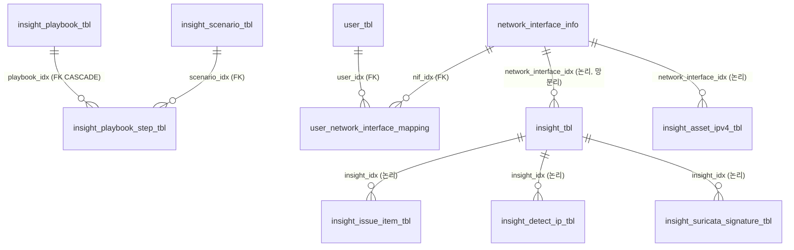

# Phase 7 — 데이터베이스 분석 (Databases & Datastores)

> 근거: `_research/07_datastores.md` (라이브 `mysql`/`_cat`/`kafka-topics` 실측). 전체 DDL 덤프는 `mysqldump -uroot --no-data --compact mnx_db`로 재생성 가능.
> **정정:** 요구서의 **PostgreSQL·Redis는 미사용**. **SQLite도 미사용**(regression_api는 JSON 파일 상태저장 `status_store.py`/`job_state.py` 사용). 실제 저장소 = **MariaDB + Elasticsearch + Kafka(+Zookeeper)**.

---

## 1. 저장소 개요

| 저장소 | 버전/프로세스 | 바인딩 | 크기 | 상태 | 역할 |
|---|---|---|---|---|---|
| **Elasticsearch** | 7.17.29, 단일노드, heap 4g | `*:9200`/`*:9300` | 18GB (**90% 사용, 여유 1.8GB ⚠**) | green | 세션/플로우/페이로드/통계 대용량 저장 |
| **MariaDB** | `mariadbd`, `mnx_db` | `127.0.0.1:3306` ✅ | 41.8MB(논리) | 정상 | 관계형 설정/상태(사용자/플레이북/이슈/룰) |
| **Kafka** | 3.8.0, broker.id 0, ZK모드 | `*:9092` | — | 정상 | 파일분석 작업 큐(단일 토픽) |
| **Zookeeper** | 3.8.4 | `*:2181` | — | 정상 | Kafka 메타데이터 전용 |
| **Redis** | — | — | — | **미사용** | (샘플 설정에만 주석 존재) |
| **SQLite/PostgreSQL** | — | — | — | **미사용** | — |

> **HA 부재**: ES/Kafka/MariaDB 모두 단일 인스턴스 **RF=1**. 백업 미확인. → 최상위 운영 리스크(Phase 12·13).

---

## 2. MariaDB `mnx_db` — 63 테이블

- **클라이언트**: **Spring Boot Core API(`mnx_api_server`)가 유일**. 계정 `mnx`@`%`(Jasypt 암호, 마스터키 `JASYPT_PASSWORD=Toswm#0501` 평문 노출). mnxmc 콘솔·웹 컨테이너는 **직접 접속 안 함**.
- **엔진/charset**: 전 테이블 InnoDB, utf8mb4. **대부분 비정규화**(논리 `*_idx` 조인, DB FK는 2쌍만 존재).

### 2.1 도메인별 주요 테이블

**사용자/감사**
| 테이블 | 행 | 용도 |
|---|---|---|
| `user_tbl` | 0* | 콘솔 계정, 역할(supervisor), per-user API키, IP 허용범위, 로그인 잠금 |
| `user_network_interface_mapping` | 1 | 사용자↔네트워크(망) 접근 매핑 (**FK 有**) |
| `secui_auth` | 0 | SECUI 방화벽 연동 자격/차단기간 |
| `audit_tbl` / `audit_menu_tbl` | 83/13 | 콘솔 감사로그 + 메뉴 룩업 |

**인사이트/탐지 (SOC 코어)**
| 테이블 | 행 | 용도 |
|---|---|---|
| `insight_tbl` | 4,380 | **탐지 이슈/알럿 케이스 큐**. `issue_status`(1신규/2진행/3완료/4통계), `detect_type`(1 AI/2 SIGNATURE/3 CTX/4 CUSTOM/5 FILE), `risk_level` |
| `insight_issue_item_tbl` | 3,829 | 이슈별 탐지 JSON(longtext, 최대 메타 ~9.7MB), 1:1 |
| `insight_detect_ip_tbl` | **16,060** | 이슈별 src/dst IP (**최다 행**) |
| `insight_suricata_signature_tbl` | 217 | 이슈에 매칭된 Suricata 시그니처 |
| `insight_playbook_tbl` | 97 | 플레이북 정의(action: notify/slack/mail/syslog) |
| `insight_scenario_tbl` | 97 | 시나리오/룰 본문(expression, MITRE T-ID 리스트) |
| `insight_playbook_step_tbl` | 97 | 플레이북 단계 (**유일한 실 FK 제약 쌍**, CASCADE) |
| `insight_playbook_ai_comment` | 84 | 플레이북별 LLM 코멘트 |
| `insight_asset_ipv4_tbl` | 246 | 내부 IPv4 자산 + 핑거프린트 |

**위협인텔/블랙리스트/피드**
| 테이블 | 행 | 특이점 |
|---|---|---|
| `blacklist_hash_tbl` | 16 | sha256 PK, **PARTITION BY KEY 16** |
| `blacklist_ip_tbl`/`blacklist_domain_tbl` | 0 | IP 범위/도메인 블랙리스트 |
| `ctx_feed_*_query_tbl` (5종) | 13씩 | CTX(Cont3xt) 피드 캐시, **PARTITION BY RANGE(반기, ~2030h2 + pMax)** |
| `external_ti_log` | 0 | 외부 TI API 호출 로그 |
| `malicious_ip_query_tbl` | 0 | 악성 IP 판정 캐시 |

**서버/라이선스/모듈 상태**
| 테이블 | 행 | 특이점 |
|---|---|---|
| `server_status_tbl` | **230,120** | CPU/mem/hdd 시계열(server_check.py가 30초마다 적재). **무제한 증가 ⚠ purge 없음** |
| `server_module_tbl` | 2 | 모듈 heartbeat 카운터(drop/packet/session) |
| `network_interface_info` | 0* | 인터페이스↔망 이름. 다수 테이블이 `network_interface_idx`로 참조 |
| `suricata_rule_tbl` | **5,468** | **Suricata 룰의 원본(system of record)**, ~4.6MB, `/etc/suricata`·`/application/custom-rule`로 미러 |
| `regression_analysis` | 0 | pcap 재검증 잡(regression_api 연동) |
| `stat_report_tbl` | 77 | 예약 통계 리포트 잡 |
| `*_auto_complete_tbl` | 442/39/0/0 | 검색 자동완성 사전 |

**설정** (대부분 0행, 앱 런타임 관리): `set_mail_tbl`, `set_syslog_tbl`, `set_backup_tbl`, `set_data_reset_tbl`, `set_detect_rule_tbl`, `set_logo_tbl`, `sns_slack_tbl`, `splunk_env_tbl` 등.

### 2.2 관계(ER) — 논리 허브 중심

- **실 FK는 2쌍뿐**: `insight_playbook_step_tbl`(→playbook,scenario), `user_network_interface_mapping`(→user,nif). 나머지는 애플리케이션 레벨 조인 규약.
- **`network_interface_info.idx`**가 거의 모든 데이터의 **망(멀티테넌트) 분리 축**(`network_interface_idx`).
- **`insight_tbl.idx`**가 케이스 데이터의 허브.

### 2.3 설계 주의점
- 파티셔닝은 의도된 쓰기 패턴에 적합하나 `ctx_feed_*`의 `pMax`는 2030 이후 자동 pruning 안됨(추정 유지보수 이슈).
- **성장 테이블 무제한**: `server_status_tbl`(230k↑), `insight_*` — 앱 purge(`set_data_reset_*`)에 의존하나 활성 여부 미확인(추정).

---

## 3. Elasticsearch — ~28 인덱스

- 익명 인증(`authMode=anonymous`, tls:false) — 접근제어 공백(망 격리 의존).
- **Writer**: `capture`, `mnxdpi`(16스레드 bulk consumer), `payload_analysis`. **Reader**: Spring API, (구)레거시 뷰어.

### 3.1 핵심 인덱스 카탈로그
| 인덱스 패턴 | 용도 | 문서수 | 크기 | 주요 필드 |
|---|---|---|---|---|
| **`mnx_sessions3-YYMMDD`** (일) | **세션/플로우 SPI(코어 NDR 데이터)** | ~16.0M | ~17.6GB(성수기 7GB/일) | 115필드: source/destination/network/http/dns/tls.cert/krb5/ldap/dhcp/email/file/fileId/ipProtocol/@timestamp (ECS 기반 하이브리드) |
| **`payload_YYMM`** (월) | 추출 파일/페이로드 분석 결과 | ~8k | ≤7MB | md5/sha1/sha256/payload_type/classification/av/vt/yara/ai/ctx/session_id |
| **`net-stats-YYYYMM`** (월) | 인터페이스 처리량 시계열 | ~800k | ≤33MB | interface/mbps/pps/@timestamp |
| **`playbook-YYYY`** (년) | 플레이북 탐지 히트(MariaDB `insight_idx` 연결) | 47,859 | 6.3MB | insight_idx/playbook_risk_level/session_id |
| `mnx_fields_v30` | capture 필드 정의/UI 메타 | 409 | 100KB | — |
| `mnx_files_v30` | **pcap 파일 레지스트리** | 289 | 162KB | — |
| `mnx_sequence_v30` | 단조 시퀀스 카운터(capture가 사용) | 1 | 3KB | — |
| `mnx_stats/dstats/hunts/lookups/views/notifiers` | 엔진 메타/저장검색/헌트 | 소량 | — | — |
| `.ml-*/.monitoring-*/ilm-history-*` | ES/X-Pack 내부 | 소량 | — | — |

**템플릿만 존재(데이터 없음, 기능 활성 추정)**: `mail_content-*`(email-template), `ai_content-*`(ai-content-template) — payload_analysis가 LLM 대화/메일 추출 시 생성.

### 3.2 템플릿 / ILM
- MNX 템플릿(레거시 v1): `mnx_sessions3_template`(order 99) + `mnx_sessions3_ecs_template`(order 1), `network-stats`, `payload`, `playbook-template`, `email-template`, `ai-content-template`.
- **MNX 데이터 인덱스는 ILM 미관리**. 존재하는 15개 ILM 정책은 모두 ES 스톡 기본값(사용 안 됨). 보존은 **capture `rotateIndex=daily` + 앱/cron purge**(추정, 명시적 expire 미발견).

---

## 4. Kafka — 단일 토픽 작업 큐

| 토픽 | 파티션 | RF | 보존 | Producer | Consumer |
|---|---|---|---|---|---|
| **`request-file-analysis`** | 1 | 1 | 7일 | **mnxdpi**(librdkafka++, localhost:9092) | **payload_analysis**, group `mnx` (offset 4263, **lag 0**) |
| `__consumer_offsets` | 50 | 1 | compact | 내부 | 내부 |

- `num.partitions=1`, 전 RF=1, `log.retention.hours=168`. **단일 노드 무이중화**.
- **흐름**: mnxdpi가 `/data/payload` 파일 추출 → "분석요청" 메시지 produce → payload_analysis(C++, group mnx) consume → AV/YARA/VT/AI → ES `payload_*`. 누적 4,263건 처리, 백로그 없음.

---

## 5. Zookeeper / Redis / SQLite

- **Zookeeper**: 이 Kafka 브로커 메타데이터 전용(broker 등록/파티션/컨트롤러 선출/컨슈머그룹 조정). MNX 앱 데이터 미저장. 저위험 의존.
- **Redis**: **미배포·미사용**. 근거: 프로세스 없음, 6379 미청취, 설정 내 "redis"는 `wise.ini.sample`·`suricata.yaml.bak`의 **주석 샘플**뿐.
- **SQLite**: 미사용. regression_api는 잡 상태를 **JSON 파일**(`status_store.atomic_write_json`)로 관리.

---

## 6. 로그-십핑 파이프라인

**Logstash/Filebeat 없음** — 전부 MNX 네이티브 바이너리로 인제스트.
```
ens192 ──┬─ capture ─→ ES mnx_sessions3-* + pcap(/pipeline/raw,/data/raw)
         └─ suricata ─→ /logs/suricata/eve.json (regular file)
mnxdpi(/data/raw) ─→ ES mnx_sessions3-* + Kafka request-file-analysis + /data/payload
Kafka ─→ payload_analysis(group mnx) ─→ ES payload_*/ai_content-*/mail_content-*
eng_monitor ─→ ES net-stats-*
```
- **eve.json → ES 브리지는 미확정(추정)**: eve.json은 suricata만 open. capture `suricata.so` 플러그인 경유로 세션/insight에 결합되는 것으로 추정(정확한 reader 미확인 — 인수 시 확정 필요). Suricata 시그니처가 `insight_suricata_signature_tbl`에 남는 것이 다운스트림 상관 근거.

---

## 7. 백업 & 보존 현황

| 저장소 | 보존 | 백업 |
|---|---|---|
| ES `mnx_sessions3-*` | 일 인덱스 회전, 삭제는 앱/cron(추정, ILM 미바인딩) | **스냅샷 저장소/SLM 미사용(추정 백업 없음)** |
| ES 기타 | 월/년 인덱스, ILM 없음 | 없음(미확인) |
| MariaDB | 성장 테이블 auto-purge 없음 | `set_backup_tbl`/history 존재하나 **0행 → 활성 스케줄 없음(추정)** |
| Kafka | 7일 | 없음(휘발성 큐) |

> 🔴 **인수 즉시 확인 3건**: (1) ES 디스크 flood-stage 임박(여유 1.8GB), (2) ES/MariaDB 실백업 존재 여부, (3) `mnx_sessions3` 삭제 로직 실제 동작 여부.

---

## 8. 저장소별 장애 폭발반경

| 저장소 | 다운 시 |
|---|---|
| **Elasticsearch** | **치명/전면**. 세션/페이로드/통계/엔진 메타 읽기·쓰기 불가. capture/mnxdpi bulk 실패→백프레셔→유실. UI 검색·인사이트·리포트 붕괴. **현재 90% 디스크로 write-block 임박** |
| **MariaDB** | **높음**. 로그인/플레이북/이슈큐/블랙리스트/설정/Suricata 룰 원본 불가. 라이브 캡처(ES)는 지속 |
| **Kafka** | **중간/국소**. 파일분석 큐만. mnxdpi produce 실패→새 파일 미큐잉. 세션/통계는 지속 |
| **Zookeeper** | **중간(=Kafka)**. |
| **Redis** | 영향 없음(미사용) |

공통 악화요인: 전 저장소 단일 인스턴스·RF=1·백업 미확인 → 디스크/노드 손실 시 복구 불가.
