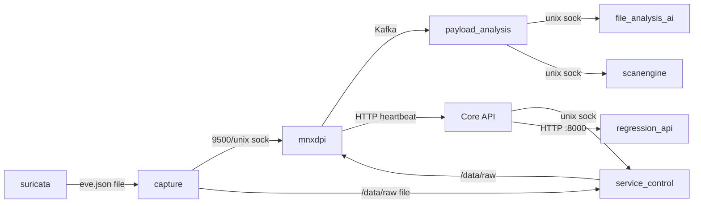

# Phase 9 — 스레드 / 멀티프로세스 / IPC 분석

> 근거: `ps -eLf`/`ps` 스레드·프로세스 관측, `mnx_config.json` 워커설정, 소스(`mp_manager.py`,`worker_pool.py`,`app.py`), config.ini(TPACKET/소켓).
> 대상: 멀티스레드 · 멀티프로세스 · Queue · IPC · 공유메모리 · Signal · Socket.

---

## 1. 프로세스/스레드 동시성 모델 (컴포넌트별)

| 컴포넌트 | 모델 | 관측/설정값 | 근거 |
|---|---|---|---|
| **capture** | 멀티스레드(C) | packetThreads 2 + ES/writer/close 스레드 | config.ini, TPACKET_V3 |
| **mnxdpi** | 멀티스레드(C++) | 관측 **29 스레드**; `worker_count=64`, `subworkers_count=3`, `queue_size=10000` | ps, mnx_config.json |
| **payload_analysis** | 멀티스레드(C++) | `worker_count=8`, `subworker_count=2` | mnx_config.json |
| **file_analysis_ai** | **멀티프로세스(prefork)** | 마스터1 + **워커 16**(관측) | ps, `MP_MANAGER`/`WORKER_PROCESS` |
| **scanengine** | 멀티스레드(C++) | `worker_count=16` | mnx_config.json |
| **service_control** | 멀티스레드(C++) | 관측 **4 스레드**, `worker_count=2` | ps |
| **regression_api** | **멀티프로세스 + 멀티스레드** | `ThreadingHTTPServer`(요청당 스레드) + 워커풀 **5 프로세스** | app.py:69, worker_pool.py:15 |
| **Core API** (Spring) | 멀티스레드(JVM) | Tomcat 스레드풀 + Hikari **300 커넥션** | application.yml |
| **Elasticsearch/Kafka/ZK** | JVM 스레드풀 | ES heap 4g, Kafka 1g, ZK 512m | ps |
| **mnxmc 콘솔** | 단일 스레드(Textual asyncio) + idle 타이머 | `MNXApp` 이벤트루프 | main_app.py |

---

## 2. 멀티프로세스 상세

### 2.1 file_analysis_ai — prefork 워커 풀
```mermaid
flowchart TD
    M[DAEMON_MAIN.run() master] --> MP[MP_MANAGER]
    MP -->|multiprocessing.Queue in| IN[(in_queue)]
    MP -->|multiprocessing.Queue out| OUT[(out_queue)]
    MP --> W1[WORKER_PROCESS #1..#16]
    W1 -->|UNIX sock| PAY[payload_analysis]
    MP --> WATCH[worker_watcher: 죽은 워커 재생성]
```
- **IPC**: `multiprocessing.Queue`(in/out) — `mp_manager.py:299` `put_nowait`, `:318` `get`, `:334` `get_bulk`.
- **워커 감시**: `__default_mode_worker_watcher()`(mp_manager.py:467), `__reuse_worker_watcher()`(:401)가 워커 사망 시 재생성.
- **외부 인터페이스**: 각 워커가 UNIX 소켓 `/var/run/payload_ai_analysis.sock`로 요청 수신.

### 2.2 regression_api — 하이브리드
- `ThreadingHTTPServer`(app.py:69) → **요청마다 스레드** 생성(BaseHTTPRequestHandler).
- 실제 작업은 `worker_pool`(worker_pool.py:15 `init_pool(5)`)의 **5개 프로세스**가 `Queue`(`submit_job`→`_worker_loop`)로 소비 → Suricata 서브프로세스 실행.
- 즉 **I/O 수용(스레드) + CPU 작업(프로세스) 분리**.

---

## 3. IPC 채널 종합

| 채널 | 종류 | 경로/주소 | 생산자→소비자 | 데이터 |
|---|---|---|---|---|
| service_control 제어 | **UNIX socket** | `/var/run/service_control.sock` | Core API/콘솔 → service_control | 모듈 start/stop/status |
| AI 분석 | **UNIX socket** | `/var/run/payload_ai_analysis.sock` | payload_analysis → file_analysis_ai(16워커) | `{file_type,file_path}`→`{label,score}` |
| AV 분석 | **UNIX socket** | `/var/run/payload_scanengine.sock` | payload_analysis → scanengine | 파일→AV 판정 |
| DPI 연동 | **UNIX socket + TCP** | `/var/run/`(libmnxdpi_sock), `localhost:9500` | capture(libmnxdpi.so) → mnxdpi | 세션 JSON |
| 파일분석 큐 | **Kafka** | 토픽 `request-file-analysis` | mnxdpi → payload_analysis(group mnx) | 분석요청 메시지 |
| pcap 파이프 | **파일시스템** | `/pipeline/raw`→(service_control 60s)→`/data/raw` | capture → service_control → mnxdpi | pcap 파일 |
| payload 파이프 | **파일시스템** | `/data/payload/YYYY/MM/DD` | mnxdpi → payload_analysis | 추출 파일 |
| alert 파이프 | **파일시스템** | `/logs/suricata/eve.json` | suricata → capture(suricata.so)/regression_api | alert JSON |
| heartbeat | **HTTP(S)** | `:8443/api/server/module/save` | mnxdpi/service_control/모듈 → Core API | 모듈 상태 |
| 메트릭 | **HTTP** | `:8000` 등 | Core API → regression_api | 재검증 |
| in/out 작업 | **multiprocessing.Queue** | 프로세스 내부 | file_analysis_ai, regression_api | 작업 아이템 |
| DB | **TCP** | `127.0.0.1:3306` | Core API → MariaDB | JPA |
| 색인/검색 | **HTTP** | `:9200` | capture/mnxdpi/payload/API → ES | bulk/search |



---

## 4. 공유 메모리 / 커널 IPC

| 메커니즘 | 사용처 | 근거 |
|---|---|---|
| **AF_PACKET TPACKET_V3 ring** | capture(2 스레드), suricata(cluster_flow) — 커널↔유저 mmap 링버퍼 | config.ini, suricata af-packet |
| **mmap pcap direct 읽기** | mnxdpi `pcap.mode=direct`, `page_size_k=256`, `pre_pages_g=2`, `page_prefetch` | mnx_config.json |
| 대용량 가상메모리 | mnxdpi 관측 **VSZ 8.7GB / RSS 17%** — PACE2 상태 + mmap 페이지 | ps |
| SysV/POSIX shm | 명시적 사용 미발견(추정 없음) | — |

> mnxdpi의 `direct` 모드 + 페이지 프리페치는 대용량 pcap을 mmap으로 직접 읽어 복사를 줄이는 구조. `/dir_cache`(dpi_workspace)가 작업공간.

---

## 5. Signal 처리

| 프로세스 | 시그널 | 핸들러 | 동작 |
|---|---|---|---|
| mnxmc 콘솔 | SIGINT/SIGTERM 등 | `signal_handler`(main-login.py:235), `setup_signal_handlers`(:249) | 터미널 상태 복원 + cleanup |
| regression_api | SIGTERM | `_sigterm_handler`(app.py:340) | 워커풀 graceful shutdown |
| syslog.py | (cron oneshot) | — | 단발 실행 |
| mnxdpi | `-K`(정지 커맨드) | 유닛 ExecStop | 별도 프로세스로 종료 신호 |
| file_analysis_ai | `stop` 인자 | daemon.py stop() → PID로 종료 | 데몬 정지 |
| payload/scan/service_control | `-d` 데몬, systemd SIGTERM | 유닛 관리 | `TimeoutStopSec=infinity`(주의) |

> ⚠ payload/scan/ai/service_control 유닛은 `TimeoutStopSec=infinity`+`SendSIGKILL=no` → **정지 시 hang하면 systemd가 강제종료 못 함**(영구 대기 위험, Phase 12).

---

## 6. Socket 인벤토리 (리슨)

| 소켓 | 소유 | 용도 |
|---|---|---|
| TCP `*:8443` | Core API | REST(HTTPS) |
| TCP `*:9200`/`*:9300` | ES | REST/transport |
| TCP `*:9092`/`*:2181` | Kafka/ZK | 버스/메타 |
| TCP `127.0.0.1:3306` | MariaDB | DB |
| TCP `0.0.0.0:8000` | regression_api | 내부 API |
| TCP `0.0.0.0:80/443/8090` | nginx | 웹 |
| TCP `localhost:9500` | mnxdpi | libmnxdpi 연동 |
| UNIX `/var/run/*.sock` | service_control/AI/AV | IPC |

(전체 포트 노출·보안은 Phase 11)

---

## 7. 동시성 경합/락 리스크 (요약, 상세 Phase 13)

1. **파일시스템을 큐로 사용** — `/data/raw`, `/data/payload`가 IPC 매개. 디스크 포화 시 전 체인 블록(현재 실장애).
2. **capture 무한 재시도 루프** — ES 블록 시 backoff 없이 스핀(CPU/로그 낭비).
3. **`multiprocessing.Queue` 백프레셔** — file_analysis_ai in_queue full 시 payload_analysis 블록(mp_manager `is_inqueue_full`).
4. **Hikari 300 커넥션** — MariaDB `max_connections` 대비 과다 시 커넥션 고갈(추정, MariaDB 기본값 확인 필요).
5. **단일 파티션 Kafka** — 소비자 병렬화 불가(파티션 1), 처리량 상한.

---

## 8. 인수인계 핵심 포인트

1. **IPC의 절반이 파일시스템 경유** — 디스크 상태가 곧 파이프라인 상태. 모니터링 필수.
2. UNIX 소켓 4종(`service_control`/`ai`/`scanengine`/`libmnxdpi`)이 분석 체인의 신경. 소켓 부재 시 해당 링크 단절.
3. file_analysis_ai·regression_api는 **프로세스 풀** — 워커 수(16/5)와 큐 크기가 처리량 결정.
4. `TimeoutStopSec=infinity` 유닛들의 정지 hang 위험을 재시작 절차에 반영(Phase 12).
