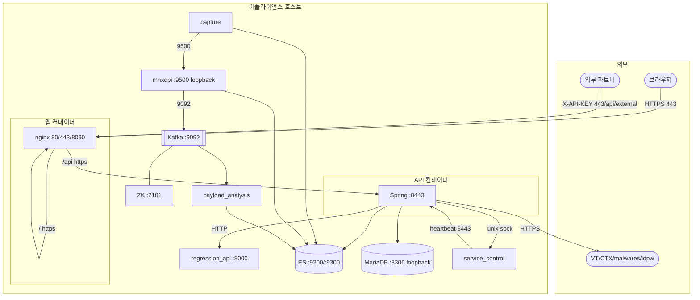

# Phase 11 — 네트워크 분석

> 근거: `ss -tlnp` 실측(`_research/00`), nginx conf, compose(`network_mode:host`), `mnx_config.json`, `_research/05·07`.
> 대상: Listen 포트 · Connect 포트 · 내부/외부 API · TLS/HTTP/HTTPS · Kafka · ES · Redis · 전 통신.

---

## 1. Listen 포트 매트릭스 (실측)

| 포트 | 프로토콜 | 소유 프로세스 | 바인딩 | TLS | 노출 | 역할 |
|---|---|---|---|---|---|---|
| 80 | HTTP | nginx(웹 컨테이너 2254) | `0.0.0.0`/`::` | — | 외부 | →301 HTTPS 리다이렉트 |
| **443** | HTTPS | nginx | `0.0.0.0`/`::` | ✅(만료) | 외부 | **공개 정문**(SPA + `/api` 프록시) |
| 8090 | HTTPS | nginx | `0.0.0.0`/`::` | ✅ | 외부 ⚠ | SPA 정적 호스트(중복 공개) |
| **8443** | HTTPS | Core API(java 2294) | `*` | ✅ | 외부 ⚠ | Spring REST API(직접 노출) |
| 8000 | HTTP | regression_api(python 18814) | `0.0.0.0` | ❌ | 외부 ⚠ | 내부 재검증 API(무인증) |
| 8005 | — | (없음) | — | — | — | nginx `/mnx/api` 대상 — **리스너 없음(dead)** |
| 9200 | HTTP | ES(java 15810) | `*` | ❌ | 외부 ⚠ | Elasticsearch REST(익명) |
| 9300 | TCP | ES | `*` | ❌ | 외부 ⚠ | ES transport |
| 9092 | TCP | Kafka(java 17016) | `*` | ❌ | 외부 ⚠ | Kafka 브로커 |
| 2181 | TCP | Zookeeper(java 16373) | `*` | ❌ | 외부 ⚠ | ZK |
| 9500 | TCP | mnxdpi(18076) | `localhost` | ❌ | 로컬 ✅ | libmnxdpi 연동 |
| 3306 | TCP | MariaDB(1347) | `127.0.0.1` | ❌ | 로컬 ✅ | `mnx_db` |
| 12045/14029 | TCP | Kafka/ZK JMX 등 | `*` | ❌ | 외부 ⚠ | JVM 부가 포트(추정) |
| 22 | SSH | sshd | `0.0.0.0` | ✅ | 외부 | 관리 |
| UNIX sock | — | service_control/ai/scanengine | `/var/run/*.sock` | — | 로컬 ✅ | IPC |

> 🔴 **노출 리스크**: 443/8090/8443/8000/9200/9300/9092/2181이 `0.0.0.0`/`*` 바인딩 → **호스트 방화벽이 유일한 방어선**. loopback 안전 바인딩은 3306·9500뿐.

---

## 2. Connect(아웃바운드) 매트릭스

| 출발 | 목적지 | 프로토콜 | 용도 |
|---|---|---|---|
| capture | localhost:9200 | HTTP | 세션 bulk 색인 |
| capture | libmnxdpi 소켓/9500 | TCP/UNIX | mnxdpi 연동 |
| mnxdpi | localhost:9200 | HTTP | 세션 색인(16스레드) |
| mnxdpi | localhost:9092 | TCP | Kafka produce |
| mnxdpi | :8443/api/server/module/save | HTTPS | heartbeat(cert 무검증) |
| payload_analysis | localhost:9092 | TCP | Kafka consume(group mnx) |
| payload_analysis | UNIX sock(ai/scan) | UNIX | AI/AV 팬아웃 |
| payload_analysis | localhost:9200 | HTTP | payload 색인 |
| service_control | :8443 | HTTPS | heartbeat/patch/version |
| service_control | `/var/run/*.sock`, systemctl | UNIX | 모듈 제어 |
| Core API | 127.0.0.1:3306 | TCP | MariaDB(Hikari 300) |
| Core API | localhost:9200 | HTTP | ES 조회/색인 |
| Core API | localhost:8000 | HTTP | regression_api/SECUI |
| Core API | `/var/run/service_control.sock` | UNIX | 모듈 제어 |
| Core API | VT/CTX/malwares/idpw | HTTPS | TI enrichment |
| Core API | SMTP/Slack/Splunk HEC | 각종 | 알림/전달 |
| server_check | 웹 `/api/server/status/save` | HTTP | 리소스 보고 |
| eng_monitor | localhost:9200 | HTTP | net-stats 색인 |
| regression_api | localhost:9200 | HTTP | 세션 enrich |
| mnxmc 콘솔 | localhost:9200, Kafka CLI | HTTP/CLI | 모니터링 |
| updater_bitdefender | BitDefender 서버 | HTTPS | AV 갱신 |
| update_mitre_attack | github raw | HTTPS | MITRE |

---

## 3. 통신 토폴로지

---

## 4. TLS / 암호화 현황

| 채널 | 암호화 | 상태 |
|---|---|---|
| 브라우저↔nginx(443/8090) | TLS | 🔴 **self-signed 데모 인증서, 2024-10-15 만료** (`O=Internet Widgits Pty Ltd`), key 패스 `mnx#123` 평문 |
| nginx↔API(8443) | HTTPS | jar 내부 keystore `certificate.pfx`(jasypt 암호) |
| API↔ES(9200) | **평문 HTTP** | `secure:false`, 익명 |
| capture/mnxdpi/payload↔ES | **평문 HTTP** | `tls:false`, 익명 |
| mnxdpi/service_control↔API heartbeat | HTTPS(**cert 무검증**) | `core_api_cert_verify:false` |
| API↔MariaDB(3306) | 평문(loopback) | 로컬 한정 |
| mnxdpi↔Kafka(9092) | 평문 | 로컬 |
| API↔외부 TI | HTTPS | 정상 |
| SSH(22) | TLS | 정상 |
| syslog 전송 | TLS 옵션 존재 | 현재 전 서버 비활성 |

> 🔴 내부 데이터플레인(ES/Kafka)은 전부 **평문+익명**. 망 분리에 전적으로 의존. 정문 TLS는 만료 인증서로 사실상 신뢰 불가.

---

## 5. 내부 API vs 외부 API

| 구분 | 엔드포인트 | 인증 | 노출 |
|---|---|---|---|
| **외부(파트너)** | `/api/external/**`, `/api/external/ctx/**`, `/api/external/idpw/**` | X-API-KEY(ROLE_EXTERNAL_API) | 443 경유 |
| **사용자(UI)** | `/api/**`(37 컨트롤러) | JWT/세션 | 443 경유 |
| **내부(서버간)** | regression_api `:8000`, service_control unix sock, heartbeat `:8443` | **무인증(8000)** / unix | 로컬(단 8000은 0.0.0.0) |
| **공개(permitAll)** | `/api/login`, `/api/server/*/save` 등 | 없음 | 443 |

---

## 6. Kafka / ES / Redis 통신 요약

- **Kafka(9092)**: 단일 브로커, 단일 토픽 `request-file-analysis`(파티션1/RF1). producer=mnxdpi, consumer=payload_analysis(group mnx). ZK(2181) 메타 의존. 평문.
- **Elasticsearch(9200/9300)**: 단일 노드. writer=capture/mnxdpi/payload/eng_monitor, reader=Core API/regression_api/콘솔. 익명·평문. **디스크 90% → flood-stage 임박**.
- **Redis**: **미사용**(포트 6379 미청취, 프로세스 없음).

---

## 7. 방화벽 / 네트워크 세그먼트

- 캡처 NIC **ens192**(promisc, monitoring/tap 전용) — mnx_config_interfaces.sh가 offload off/ring 4096 설정. 관리 트래픽 NIC와 분리(추정: 별도 관리 인터페이스).
- 호스트 방화벽: **nftables**(nf_tables/conntrack 모듈 로드) + mnxmc `firewall_manager.py`가 관리. 외부 노출 포트(8090/8443/8000/9200/9092)는 방화벽 규칙으로 차단해야 안전.
- Docker: `network_mode: host` → 컨테이너 포트가 호스트에 직접 노출(포트 포워딩/격리 없음).

---

## 8. 인수인계 핵심 포인트 / 보안 권고

1. **정문 TLS 인증서 즉시 재발급**(만료 21개월 경과).
2. **외부 불필요 포트 방화벽 차단**: 8090/8443/8000/9200/9300/9092/2181은 관리망 외 차단.
3. **regression_api(8000) 무인증** → loopback 바인딩 또는 방화벽 격리.
4. **ES/Kafka 평문·익명** → 최소한 네트워크 ACL, 가능하면 TLS+인증 도입(대규모 변경).
5. **캡처 NIC(ens192) 하드코딩** — 하드웨어/NIC 명 변경 시 캡처 실명, 네트워크 변경관리에 포함.
