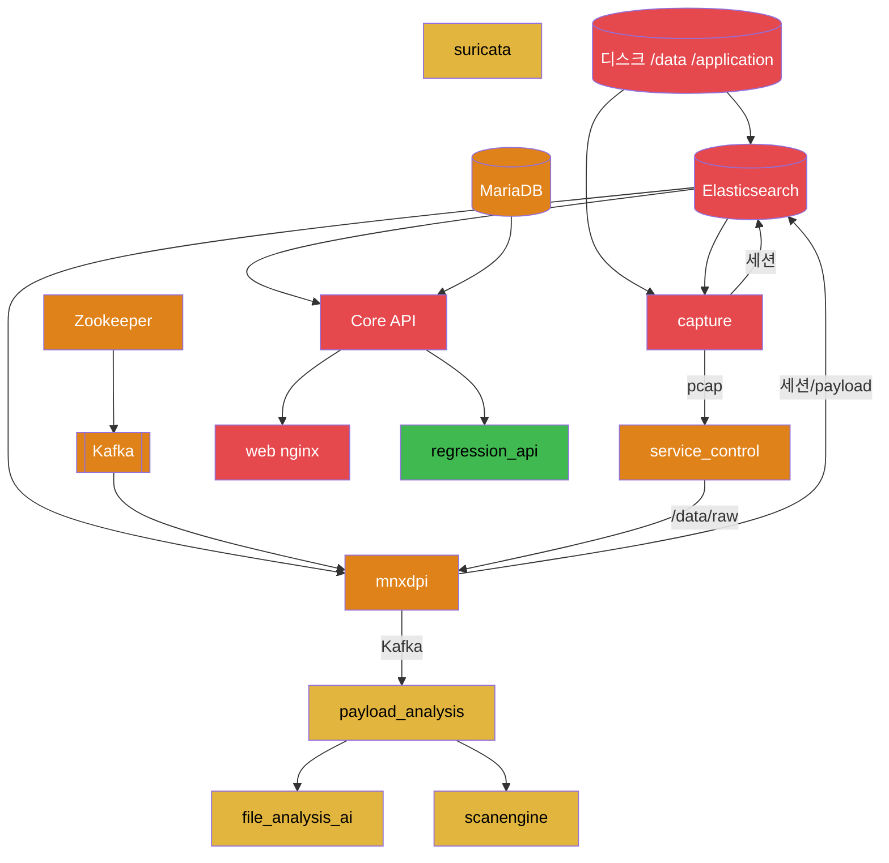

# Phase 12 — 장애 분석 (Failure & Recovery)

> 근거: systemd `Requires/Wants` 실측, IPC 토폴로지(Phase 9·11), 저장소 폭발반경(Phase 7), 현재 실장애 관측.
> 대상: 단일 서비스 사망 시 영향 범위 · 복구 방법 · 재시작 순서 · 의존성.

---

## 1. 의존성 체인 (장애 전파 방향)


(빨강=치명, 주황=높음, 노랑=중간, 초록=낮음)

---

## 2. 단일 장애 시 영향 범위표

| 죽는 대상 | 직접 영향 | 연쇄(다운스트림) | 살아남는 것 | 자동복구 |
|---|---|---|---|---|
| **디스크(/application·/data)** | ES flood-stage read-only | capture 색인 실패→무한재시도→**전 파이프라인 아사** | (없음, 전면) | ❌ 수동 |
| **Elasticsearch** | 모든 세션/payload/통계 읽기·쓰기 불가 | capture/mnxdpi/payload bulk 실패, UI 검색·인사이트·리포트 붕괴 | 라이브 pcap 캡처(파일)·suricata alert(파일) 일시 지속 | ES `systemd Restart` 없음(수동) |
| **capture** | 신규 세션/pcap 중단 | mnxdpi 입력 아사→payload/AI/AV 아사, UI 신규 데이터 없음 | 기존 데이터 조회, suricata | ✅ `Restart=on-failure`(단 crash 시만; stall은 미복구) |
| **mnxdpi** | 심층분류·payload carving 중단 | Kafka 미produce→payload/AI/AV 아사 | 세션 캡처(capture 자체 색인), UI | ✅ `Restart=on-failure/5s` |
| **service_control** | pcap `/pipeline→/data/raw` 이동 중단, heartbeat 중단 | `/pipeline` 정체→mnxdpi 입력 끊김, 웹 서버상태/버전 미갱신 | capture/ES/UI | ✅ `Restart=on-failure/5s` (단 정지 hang 시 `TimeoutStopSec=infinity`로 영구대기) |
| **Kafka** | 파일분석 큐 중단 | mnxdpi produce 실패, payload 무입력 | 세션 캡처·색인·UI | ✅(상위 Requires) |
| **Zookeeper** | Kafka 컨트롤러/메타 불가 | =Kafka 다운 | 나머지 | ✅ `Restart=on-abnormal` |
| **MariaDB** | 로그인/플레이북/이슈/룰/설정 불가 | UI 케이스관리·탐지설정 중단 | 라이브 캡처·ES 색인 지속 | 수동 |
| **Core API** | 전 REST·외부연동·스케줄 중단 | UI 비기능화, server_check/heartbeat 수신 중단 | 데이터플레인(캡처/탐지) 지속 | ✅ Docker `restart:always` |
| **web nginx** | UI·`/api` 프록시 접근 불가 | 사용자 접속 전면 불가 | API(8443 직접)·데이터플레인 | ✅ `restart:always` |
| **payload_analysis** | 파일분석 오케스트레이션 중단 | AI/AV 미호출, payload 인덱스 정체 | 세션/캡처/UI | ✅(`Requires` ai/scan 동반) |
| **file_analysis_ai/scanengine** | AI/AV 판정 불가 | payload_analysis가 해당 판정 누락 | 나머지 분석 | ✅(payload Requires) |
| **suricata** | IDS alert 중단 | eve.json 미생성→세션 alert 결합·regression 입력 손실 | 세션 캡처(양적) | ✅(enabled) |
| **regression_api** | 룰 재검증·SECUI 실패 | UI 재검증 기능만 | 코어 전부 | ✅ `Restart=on-failure` |
| **eng_monitor** | net-stats 중단 | 대시보드 처리량 그래프 공백 | 나머지 | ✅ `Restart=always` |

---

## 3. 현재 실장애 사례 (2026-07-10) — 케이스 스터디

**증상**: 7/1 이후 신규 pcap/세션 없음. capture 프로세스는 살아있음(crash 아님).

**근본원인 체인**:
```mermaid
flowchart LR
    D[/application 91% /data 77%] --> W[ES 디스크 flood-stage 95% 근접<br/>여유 1.8GB]
    W --> RO[인덱스 read-only-allow-delete 자동설정]
    RO --> SEQ[capture mnx_db_get_sequence_number_sync 429]
    SEQ --> LOOP[무한 재시도 backoff 없음]
    LOOP --> NOPCAP[신규 세션/pcap 생성 중단]
    LOOP --> LOG[capture.log 8.4GB 폭증 → 디스크 추가 압박]
    NOPCAP --> STARVE[mnxdpi submitted=0 → payload/AI/AV 아사]
```

**왜 자동복구 안 되나**: capture가 **crash하지 않고 스핀**하므로 `Restart=on-failure`가 트리거되지 않음. systemd는 "정상 실행 중"으로 인식.

**복구 절차(권장 순서)**:
1. 디스크 확보: `/data/raw` 오래된 pcap 정리(`pcap_delete.py` 수동 실행), `/logs/mnxcapture/capture.log` 절단, `/application` 리포트/백업 정리.
2. ES 여유 확보 후 read-only 해제:
   `curl -XPUT localhost:9200/_all/_settings -H 'Content-Type: application/json' -d '{"index.blocks.read_only_allow_delete":null}'`
3. `systemctl restart mnxcapture` (재시도 루프 리셋).
4. `systemctl status mnxdpi mnx_payload` 확인, 필요 시 재시작.
5. 근본 예방: ES ILM/보존, 디스크 워터마크 알림, capture 재시도 backoff(제품 개선).

---

## 4. 권장 재시작 순서

### 4.1 전체 기동 순서 (bottom-up, 의존성 준수)
```
1. (인프라)   zookeeper → kafka → elasticsearch → mariadb
2. (제어)     mnx_service_control
3. (탐지)     suricata, promisc(ens192)
4. (캡처)     mnxdpi → mnxcapture   (mnxcapture ExecStartPre: mnx_config_interfaces.sh)
5. (분석)     mnx_payload_ai, mnx_payload_scan → mnx_payload
6. (부가)     mnx_regression_api, eng_monitor
7. (UI)       docker: mnx_api_server → mnx_web_server
```
> `/data/tools/MNX_all_start_service.sh`가 이 순서를 캡슐화(운영 표준 도구). 정지는 `MNX_all_stop_service.sh`(역순), 순서검증 `MNX_check_stop_order.sh`.

### 4.2 전체 정지 순서 (top-down, 역순)
```
UI(web→api) → 부가(regression,eng_monitor) → 분석(payload→ai,scan)
→ 캡처(mnxcapture→mnxdpi) → 제어(service_control) → 탐지(suricata)
→ 인프라(mariadb, elasticsearch → kafka → zookeeper)
```
> ⚠ `TimeoutStopSec=infinity` 유닛(payload/ai/scan/service_control)은 정지 hang 시 강제종료 불가 → `MNX_check_stop_order.sh`로 상태 확인 후 필요 시 수동 `kill`. DB 없이 정지하는 `without_db_MNX_all_stop_service.sh`도 존재.

---

## 5. 단일 장애점(SPOF) 정리

| SPOF | 이유 | 완화책(제안) |
|---|---|---|
| Elasticsearch(단일노드) | RF=1, HA 없음, 디스크 90% | 노드 추가/샤드 복제, ILM, 디스크 알림 |
| capture(단일 프로세스) | 데이터 원천, stall 미감지 | 워치독(429/정체 감지), 재시도 backoff |
| Kafka/ZK(단일) | RF=1 | 브로커 다중화(대규모) |
| MariaDB(단일) | 백업 미확인 | 정기 dump + 복제 |
| service_control | pcap 스테이징 병목 | 정지 hang 방지, 워치독 |
| 디스크 `/data`,`/application` | 큐·데이터 겸용, 포화 임박 | 용량증설, 보존정책, 알림 |

---

## 6. 감지·모니터링 갭 (인수 시 보강)

1. **capture stall 미감지** — 프로세스 alive지만 데이터 0. → "최근 pcap 시각" 헬스체크 필요.
2. **디스크 워터마크 알림 없음** — flood-stage 도달 전 경보 필요.
3. **eng_monitor ES bulk `Partial errors` 무시** — 매 사이클 오류를 조용히 넘김(매핑 충돌 추정).
4. **컨테이너 헬스체크 부재** — compose에 healthcheck 없음(추정), `restart:always`만.
5. **로그 rotate 1** — 장애 원인 로그가 회전으로 유실될 수 있음.

---

## 7. 인수인계 핵심 포인트

1. **"프로세스 살아있음 ≠ 정상 동작"** — 현 장애가 대표 사례. 데이터 신선도 기반 헬스체크가 최우선 보강.
2. 표준 기동/정지는 반드시 `/data/tools/MNX_all_*_service.sh` 사용(순서·의존성 캡슐화).
3. ES가 전 시스템의 심장 — 디스크·상태 모니터링 1순위.
4. `TimeoutStopSec=infinity` 유닛의 정지 hang을 재시작 런북에 명시.
