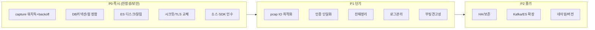

# Phase 15 — 리팩토링 제안 (Refactoring & Improvement)

> 근거: Phase 1~14 분석 결과. 각 제안은 **문제(근거) → 제안 → 기대효과 → 난이도** 형식.
> 우선순위: P0(즉시/안정성·보안) · P1(단기) · P2(중기 아키텍처).

---

## 1. Architecture 개선

### A1. 데이터플레인 안정화 계층 도입 (P0)
- **문제**: capture가 ES 블록 시 backoff 없이 무한 스핀, crash 아니라 자동복구 실패(현 실장애).
- **제안**: (1) capture 재시도에 지수 backoff+상한, (2) **데이터 신선도 워치독**(최근 pcap/세션 시각 감시→알림·자동 재시작), (3) ES flood-stage 사전 알림.
- **효과**: 조용한 실명 → 감지·자동복구 가능. **난이도: 중**(제품 코드 + 워치독 스크립트).

### A2. 저장소 HA/보존 재설계 (P1)
- **문제**: ES/Kafka/MariaDB 전부 단일·RF=1·백업 미확인, ES 디스크 90%, ILM 미사용.
- **제안**: ES 다중노드+복제 또는 최소 **ILM/보존 정책 + 스냅샷(SLM)**, MariaDB 정기 dump+복제, Kafka 파티션·RF 상향, 디스크 워터마크 알림.
- **효과**: 데이터 손실·무한증가 방지, 확장성 확보. **난이도: 중~고**.

### A3. pcap 파이프라인 IO 최적화 (P1)
- **문제**: capture가 `/pipeline/raw`에 쓴 pcap을 service_control이 `/data/raw`로 **재복사**(이중 IO).
- **제안**: 동일 파일시스템이면 `rename`/hardlink로 이동, 또는 capture가 `/data/raw` 직접 기록.
- **효과**: 10Gbps 시 디스크 대역 절반 절감. **난이도: 중**.

### A4. 파일분석 수평확장 (P2)
- **문제**: Kafka 파티션1·단일 소비자 → 처리량 상한.
- **제안**: 토픽 파티션 증설 + payload_analysis 소비자 그룹 스케일아웃, AI 추론 GPU/배치화.
- **효과**: 대용량 파일 트래픽 대응. **난이도: 중**.

---

## 2. Directory 구조 개선

### D1. 배포 표준화 (P1)
- **문제**: 엔진이 `/opt/mnx`, `/opt/mnxdpi`, `/opt/payload_analysis`, `/opt/scanengine`, `/opt/service_control`, `/opt/regression_api`, `/opt/file_analysis_ai`, `/opt/syslog`, `/opt/server_check`로 산재; 설정은 `/opt/mnx/etc`에 집중; 데이터는 `/data`·`/application`·`/pipeline`·`/dir_cache`로 분산; 운영도구는 `/data/tools`.
- **제안**: 논리 구조 문서화 + 심볼릭 표준(예: `/opt/mnx/{bin,etc,lib,share}` 통일), 데이터 마운트 역할 명시(README/이 문서로 갈음).
- **효과**: 신규 인력 온보딩 시간 단축. **난이도: 저**(문서/링크).

### D2. 잔재 정리 (P1)
- **문제**: `storcli.log`(각 디렉터리), `*.bak`, `*.swp`, `mnxdpi.debug`, 미사용 node/레거시 뷰어.
- **제안**: 배포 패키지에서 제외 + 정리 스크립트.
- **효과**: 이미지/디스크 절감, 혼선 제거. **난이도: 저**.

---

## 3. Naming 개선

### N1. 제품 정체성 일관화 (P2)
- **문제**: 레거시 브랜딩 문자열 잔재, 버전 트랙 이원화(콘솔 2.3.0 / 엔진 v23.5.1.2), `sands-test-*` pcap 파일명(테스트 흔적).
- **제안**: 브랜딩 문자열 정리, **통합 버전 매트릭스** 문서화, pcap 명명 규칙 표준화.
- **효과**: 지원/디버깅 혼선 감소. **난이도: 저**.

### N2. 설정 키 네이밍 (P2)
- **문제**: `incex_session_prefix`(오타성), `Index_refresh_time`(대소문자 혼용) 등 mnx_config 키 비일관.
- **제안**: 키 정규화(하위호환 별칭 유지).
- **효과**: 설정 실수 감소. **난이도: 저**.

---

## 4. 모듈 분리 / 코드 구조

### M1. 인증 로직 단일화 (P1)
- **문제**: mnxmc 인증 3중 구현(`utils/auth.py` dead + `login.py` + `service.py`).
- **제안**: `utils/auth.py`로 단일화(또는 PAM 표준 사용), `spwd`/`crypt` 의존 제거(3.13 대비).
- **효과**: 보안 일관성 + Python 3.13 호환. **난이도: 중**.

### M2. dead route/참조 제거 (P1)
- **문제**: nginx `/mnx/api→8005`, `service_list.ai_dga`(미배포), 미사용 plugins/parsers.
- **제안**: 설정에서 제거, 실제 로드 플러그인만 유지.
- **효과**: 공격면·혼선 감소. **난이도: 저**.

### M3. C/C++ 소스·빌드 저장소 확보 (P0, 조직)
- **문제**: capture/mnxdpi/payload/scanengine/service_control **소스 부재**(어플라이언스엔 산출물만).
- **제안**: 빌드 저장소·CI 파이프라인·상용 SDK(PACE2/BitDefender) 라이선스 인수인계.
- **효과**: 유지보수 가능성 확보(현재는 불가). **난이도: 조직적**.

---

## 5. Performance 개선 (Phase 13 요약)

| # | 제안 | 우선 |
|---|---|---|
| P-1 | Hikari 풀 ↔ MariaDB `max_connections` 정합 | P0 |
| P-2 | API `-Xmx80g` → 호스트 메모리 맞춤(1g: ~8~16g) | P0 |
| P-3 | ES 디스크 확보 + ILM 보존 | P0 |
| P-4 | pcap 이중쓰기 제거(A3) | P1 |
| P-5 | mnxdpi `worker_count=64` → vCPU 정합 | P1 |
| P-6 | Kafka 파티션 증설(A4) | P2 |
| P-7 | AI 추론 GPU/배치 | P2 |

---

## 6. 운영성(Operability) 개선

### O1. 관측성(Observability) (P0)
- **제안**: (1) 데이터 신선도·디스크·커넥션·힙 메트릭을 통합 대시보드로, (2) 컨테이너/서비스 **healthcheck** 정의, (3) eng_monitor `Partial errors` 등 조용한 실패를 알림화.
- **효과**: "프로세스 살아있음 ≠ 정상"의 갭 해소. **난이도: 중**.

### O2. 로그 관리 (P1)
- **문제**: logrotate `rotate 1`(유실), capture.log 폭증.
- **제안**: rotate 세대 상향 + 압축, 애플리케이션 로그레벨/억제.
- **효과**: 장애 원인 추적성 확보. **난이도: 저**.

### O3. 부팅 견고성 (P1)
- **문제**: `sleep 5/10` 워밍업(하드 헬스체크 아님), Docker가 systemd 밖(부팅 자동기동 미검증), disabled 유닛의 pull-in 의존.
- **제안**: `sleep`→의존 서비스 readiness 체크(`ExecStartPre` 조건화), 컨테이너를 systemd 유닛화 또는 재부팅 생존 검증, 핵심 유닛 명시적 enable.
- **효과**: 재부팅 신뢰성. **난이도: 중**.

### O4. 보안 하드닝 (P0, Phase 6·11·14)
- **제안**: JWT secret·JASYPT·TLS 인증서 교체, ES/Kafka 망 격리(방화벽), 무인증 엔드포인트 잠금, regression_api loopback화, mnxmc root 셸 감사/제한.
- **효과**: 침해 리스크 대폭 감소. **난이도: 중**.

### O5. 정지 안전성 (P1)
- **문제**: `TimeoutStopSec=infinity`+`SendSIGKILL=no` 유닛 정지 hang.
- **제안**: 합리적 타임아웃 + graceful→SIGKILL 폴백.
- **효과**: 재시작/업그레이드 안정성. **난이도: 저**.

---

## 7. 우선순위 로드맵

---

## 8. 인수인계 총괄 권고

1. **가장 시급**: 현 실장애(디스크→ES→capture 스핀)의 **재발 방지 3종**(워치독·디스크알림·backoff) + **리소스 정합 2종**(DB커넥션·힙).
2. **가장 근본적**: **C/C++ 소스·빌드·상용 SDK 라이선스 인수** — 없으면 데이터플레인 유지보수 자체가 불가.
3. **가장 위험**: 보안 시크릿 3종(JWT/JASYPT/TLS)이 사실상 무력 상태 — 폐쇄망이라도 즉시 교체.
4. 이 문서(Phase 1~15 + 마스터)는 실제 코드·설정·런타임 근거에 기반하며, 소스 부재로 검증 불가한 부분은 "추정"으로 명시함. 인수자는 표시된 추정 항목을 소스 확보 후 우선 확정할 것.
