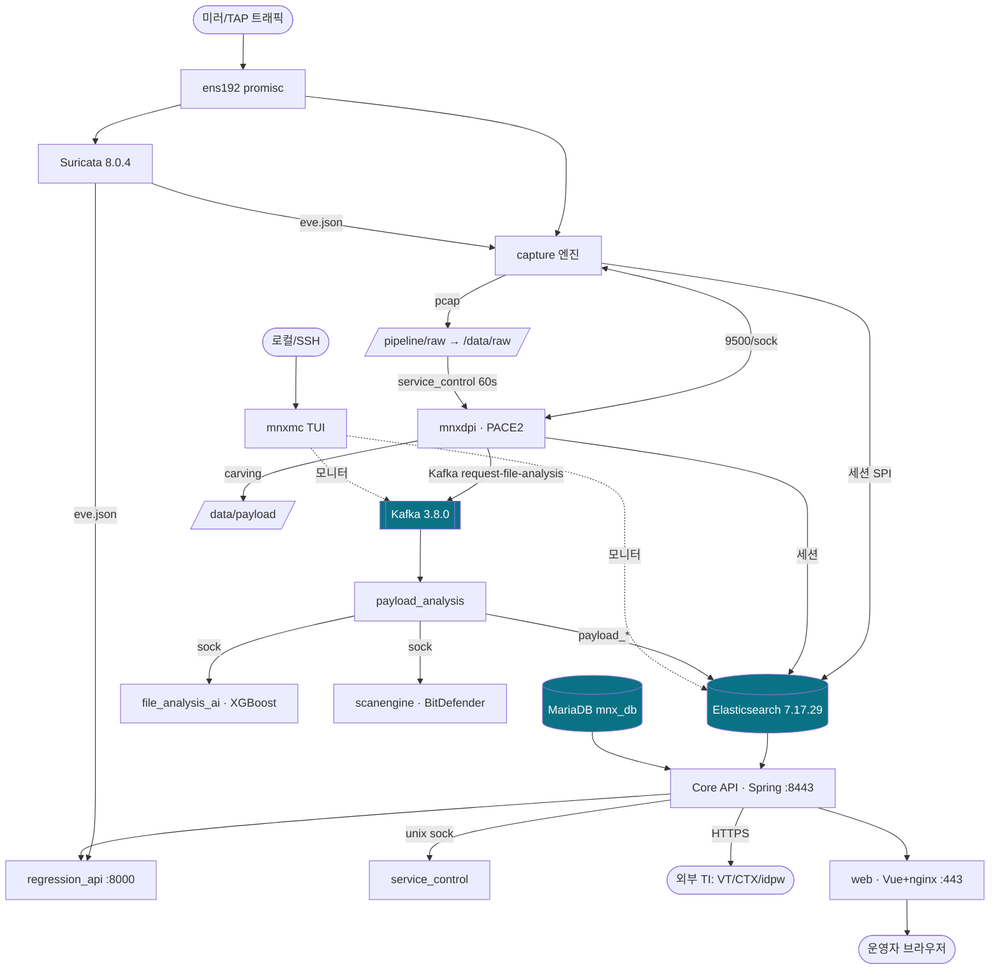

# MNX NDR — 시스템 아키텍처 인수인계 문서 (SYSTEM ARCHITECTURE)

> **대상 독자**: 신규 수석 개발자 / 운영 인수자
> **작성 근거**: 2026-07-10 운영 어플라이언스의 실제 파일시스템·프로세스·systemd·설정·데이터스토어 전수 조사. 모든 주장은 `file:line` 또는 명령 실행 결과에 근거하며, 소스 부재 등으로 검증 불가한 항목은 **"추정"**으로 명시.
> **상세 근거**: `_research/00~08_*.md`(원시 조사), 본 문서와 짝을 이루는 `01~15_*.md`(Phase별 상세).

---

## 0. 문서 지도 (Table of Contents)

| Phase | 문서 | 내용 |
|---|---|---|
| 1 | [01_project_tree.md](01_project_tree.md) | 프로젝트 트리·역할·중요도·실행/사용/DeadCode |
| 2 | [02_boot_sequence.md](02_boot_sequence.md) | 부팅·기동 순서(Mermaid) |
| 3 | [03_process.md](03_process.md) | 전 프로세스 명세(실행/옵션/IO/로그/장애) |
| 4 | [04_call_graph.md](04_call_graph.md) | 소스 콜 그래프 |
| 5 | [05_data_flow.md](05_data_flow.md) | Packet→…→UI 데이터 흐름 |
| 6 | [06_rest_api.md](06_rest_api.md) | REST API(244 엔드포인트) |
| 7 | [07_database.md](07_database.md) | MariaDB/ES/Kafka 스키마·인덱스·토픽 |
| 8 | [08_configuration.md](08_configuration.md) | 전 설정파일 분석 |
| 9 | [09_thread_ipc.md](09_thread_ipc.md) | 스레드/멀티프로세스/IPC |
| 10 | [10_dependency.md](10_dependency.md) | 의존성(라이브러리/이미지/커널) |
| 11 | [11_network.md](11_network.md) | 네트워크/포트/TLS |
| 12 | [12_failure_analysis.md](12_failure_analysis.md) | 장애 전파·복구·재시작 |
| 13 | [13_performance.md](13_performance.md) | 성능·병목 |
| 14 | [14_code_quality.md](14_code_quality.md) | 코드 품질·버그·보안 |
| 15 | [15_refactoring.md](15_refactoring.md) | 리팩토링 로드맵 |

---

## 1. 개요 (Executive Summary)

**MNX NDR**은 네트워크 미러(SPAN/TAP) 트래픽을 캡처·분석하여 위협을 탐지·대응하는 **온프레미스 가상 어플라이언스**다. 제품은 두 개의 독립된 버전 트랙으로 구성된다:

- **관리 콘솔(MNXMC) v2.3.1** — `/mnxmc`의 Python/Textual **TUI**. deb 패키지로 배포.
- **NDR 엔진 (Web/API) v23.5.1.2** — Docker 이미지 `mnx-api-v23`(Spring Boot/Java) + `mnx-web-v23`(Vue+nginx).

데이터플레인의 심장은 **자체 개발 `capture` 엔진(내부 패키지 버전 5.8.2)**이며, 여기에 자체 **`mnxdpi`(ipoque PACE2 기반 DPI)**, **Suricata IDS**, **파일분석 체인(payload_analysis + file_analysis_ai + BitDefender scanengine)**이 결합된다. 저장은 **Elasticsearch**(세션/플로우), **MariaDB**(케이스/설정), **Kafka**(파일분석 큐)가 담당한다.

> ⚠ **인수 시점의 시스템 상태**: 어플라이언스는 부팅·전 서비스 `active`이지만, **데이터 파이프라인이 2026-07-01 이후 정지**해 있다. 원인은 디스크 포화(`/application` 91%)로 인한 **ES flood-stage 읽기전용 잠금 → capture 무한 재시도 스핀**이다(§7, Phase 12). 이는 인수 후 **최우선 복구 대상**이다.

### 1.1 사용자 요구서 대비 실제 스택 (중요 정정)

| 요구서 언급 | 실제 | 근거 |
|---|---|---|
| FastAPI | **Spring Boot(Java 17)** — Python API는 별도 `regression_api`(:8000)뿐 | `mnx_api_server` `app.jar` |
| PostgreSQL | **MariaDB** `mnx_db` | `mariadbd` :3306 |
| Redis | **미사용**(주석 샘플만) | ps/포트/설정 |
| React | **Vue SPA** | `env.js`, webpack 빌드 |

---

## 2. 시스템 컨텍스트 & 아키텍처



### 2.1 논리 계층

| 계층 | 구성요소 | 기술 |
|---|---|---|
| **수집(Ingest)** | capture, suricata | C, AF_PACKET/TPACKET_V3 |
| **분석(Analyze)** | mnxdpi(DPI), payload_analysis, file_analysis_ai(AI), scanengine(AV) | C++/Python, PACE2/YARA/XGBoost/BitDefender |
| **저장(Store)** | Elasticsearch, MariaDB, Kafka, Zookeeper | JVM |
| **제어(Control)** | service_control, regression_api, eng_monitor, server_check, syslog | C++/Python |
| **표현(Present)** | Core API(Spring), Web(Vue+nginx) | Java/Vue, Docker |
| **관리(Manage)** | mnxmc 콘솔, /data/tools 스크립트 | Python/Shell |

---

## 3. 컴포넌트 카탈로그 (통합 참조표)

| 컴포넌트 | 유형 | 실행 | 포트/소켓 | 언어 | 중요도 |
|---|---|---|---|---|---|
| capture | systemd `mnxcapture`(enabled) | 상시(nobody) | →9200,→9500 | C | 필수 |
| mnxdpi | systemd `mnxdpi`(disabled/pull) | 상시(root) | 9500(loopback),→9200,→9092 | C++ | 높음 |
| suricata | systemd(enabled) | 상시(suricata) | af-packet | C | 중간 |
| payload_analysis | systemd `mnx_payload`(enabled) | 상시 | Kafka소비,unix sock | C++ | 높음 |
| file_analysis_ai | systemd `mnx_payload_ai`(disabled/pull) | 상시(16워커) | `/var/run/payload_ai_analysis.sock` | Python | 높음 |
| scanengine | systemd `mnx_payload_scan`(disabled/pull) | 상시 | `/var/run/payload_scanengine.sock` | C++ | 높음 |
| service_control | systemd `mnx_service_control`(enabled) | 상시 | `/var/run/service_control.sock` | C++ | 필수 |
| regression_api | systemd(enabled) | 상시(5워커) | :8000 | Python | 중간 |
| eng_monitor | systemd(enabled) | 상시 | →9200 | Shell | 중간 |
| Core API | Docker `mnx_api_server` | 컨테이너 | :8443 | Java/Spring | 필수 |
| Web | Docker `mnx_web_server` | 컨테이너 | :80/:443/:8090 | Vue/nginx | 필수 |
| Elasticsearch | systemd(enabled) | 상시 | :9200/:9300 | JVM | 필수 |
| Kafka/ZK | systemd(disabled/pull) | 상시 | :9092/:2181 | JVM | 높음 |
| MariaDB | systemd | 상시 | :3306(loopback) | — | 높음 |
| mnxmc 콘솔 | getty@tty1 | 상시(tty) | (없음) | Python/Textual | 높음 |

---

## 4. 데이터 흐름 요약 (상세 Phase 5)

```
미러트래픽 → ens192 ─┬─→ capture ─→ pcap(/pipeline→/data/raw) + ES 세션(mnx_sessions3-*)
                     └─→ suricata ─→ eve.json ─(suricata.so)→ capture 세션결합 / regression_api
/data/raw ─(service_control 60s)→ mnxdpi ─→ ES 세션 + Kafka(request-file-analysis) + /data/payload
Kafka ─→ payload_analysis ─(unix sock)→ {file_analysis_ai(AI), scanengine(AV)} ─→ ES payload_*
ES + MariaDB ─→ Core API(:8443) ─→ Web(:443) ─→ 운영자 / Report(PDF)
```

**핵심 사실**: 데이터 원천은 **capture 단일 지점**. pcap은 `/pipeline`→`/data`로 **2회 이동**(service_control). Kafka는 **단일 토픽·단일 소비자**. UI 데이터는 **ES(세션/알럿) + MariaDB(케이스/설정) 이원화**.

---

## 5. 저장소 요약 (상세 Phase 7)

- **Elasticsearch 7.17.29** (단일노드, RF 없음): `mnx_sessions3-YYMMDD`(세션 ~16M docs/17.6GB), `payload_YYMM`, `net-stats-YYYYMM`, `playbook-YYYY`, 엔진 메타(`mnx_fields/files/sequence`). **ILM 미사용**, 디스크 90%.
- **MariaDB `mnx_db`** (63 테이블, 41.8MB): 코어=`insight_*`(케이스), `insight_playbook*/scenario`(플레이북, 유일 FK), `suricata_rule_tbl`(5,468 룰 원본), `server_status_tbl`(230k, 무한증가), `user_tbl`, `blacklist_*`/`ctx_feed_*`(파티션). Spring API가 유일 클라이언트.
- **Kafka 3.8.0**(ZK모드, RF1): `request-file-analysis`(mnxdpi→payload_analysis group `mnx`), 7일 보존.
- **Redis/PostgreSQL/SQLite: 미사용.**

---

## 6. 네트워크 & 보안 포스처 요약 (상세 Phase 6·11·14)

**포트**: 외부노출 443/8090/8443/8000/9200/9300/9092/2181(전부 `0.0.0.0`/`*`), 로컬전용 3306/9500. 방화벽(nftables)이 유일 방어선.

**인증**: Core API = Spring Security 하이브리드(JWT + JSESSIONID + X-API-KEY), 5역할(ROOT~EXTERNAL_API), RSA 보조 로그인.

**🔴 보안 결함(즉시 조치)**:
1. **JWT 서명키가 공개 튜토리얼 값** → 토큰 위조 가능.
2. **JASYPT 마스터키 `Toswm#0501` compose 평문** → 모든 암호설정 무력.
3. **TLS 인증서 self-signed·2024-10-15 만료**, key 패스 `mnx#123` 평문.
4. **ES/Kafka 익명·평문·전 인터페이스 노출**.
5. **무인증 상태변경 API**(`/api/user/root/save` 등) + **regression_api 무인증(0.0.0.0)**.

---

## 7. 현재 장애 & 즉시 복구 런북 (Phase 12·13)

**증상**: 7/1 이후 신규 세션/pcap 없음. 프로세스는 전부 `active`.

**근본원인**: `/application` 91%(ES 여유 1.8GB) → ES flood-stage → 인덱스 `read-only-allow-delete` → capture가 시퀀스번호 색인 실패 → **backoff 없는 무한 재시도(crash 아님 → 자동복구 불가)** → `capture.log` 4.4GB↑.

**복구 절차**:
```bash
# 1) 디스크 확보
python3 /data/tools/pcap_delete.py          # /data/raw 오래된 pcap 정리
: > /logs/mnxcapture/capture.log            # 폭증 로그 절단(백업 후)
#    /application 리포트/백업 정리

# 2) ES 읽기전용 해제 (여유 확보 후)
curl -XPUT localhost:9200/_all/_settings -H 'Content-Type: application/json' \
     -d '{"index.blocks.read_only_allow_delete":null}'

# 3) 캡처 재시작(재시도 루프 리셋)
systemctl restart mnxcapture

# 4) 하류 확인
systemctl status mnxdpi mnx_payload
ls -lt /data/raw | head          # 신규 pcap 생성 확인
```
**예방**: 디스크 워터마크 알림 + ES ILM/보존 + capture 데이터 신선도 워치독.

---

## 8. 리소스 & 성능 요약 (Phase 13)

- 호스트: **12 vCPU / 50GB RAM / swap 0**.
- 🔴 **Hikari 300 > MariaDB max_connections 151** → 부하 시 커넥션 고갈(확정 결함).
- 🔴 **API `-Xmx80g` > RAM 50GB** → OOM 위험(확정 결함).
- 병목: ES 디스크 포화, pcap **이중 쓰기**(`/pipeline`→`/data`), Kafka 단일 파티션, torch CPU 추론.

---

## 9. 표준 운영 (기동/정지/도구)

**표준 도구** (`/data/tools/`): `MNX_all_start_service.sh`(순서 기동), `MNX_all_stop_service.sh`(역순 정지), `MNX_check_stop_order.sh`(정지순서 검증), `MNX_status_check.sh`(상태), `without_db_MNX_all_stop_service.sh`, `MNX_Reset.sh`. 컨테이너: `docker_run_1g.sh`/`docker_run_10g.sh`.

**기동 순서**: zookeeper→kafka→ES→mariadb → service_control → suricata/promisc → mnxdpi→mnxcapture → payload_ai/scan→mnx_payload → regression/eng_monitor → docker(api→web).

**⚠ 주의**: payload/ai/scan/service_control 유닛은 `TimeoutStopSec=infinity`+`SendSIGKILL=no` → 정지 hang 시 수동 kill 필요.

**스케줄(cron)**: server_check(~30s), syslog(5m, 현재 inert), pcap_delete(10m), logrotate(30m), payload_delete(03:30, **중복**), updater_bitdefender(4h), mitre(01:00).

---

## 10. 리스크 레지스터 (통합)

| # | 리스크 | 심각도 | Phase |
|---|---|---|---|
| R1 | 디스크 포화→ES 잠금→capture 스핀(현 실장애) | 🔴 Critical | 12,13 |
| R2 | JWT/JASYPT/TLS 시크릿 무력 | 🔴 Critical | 6,11,14 |
| R3 | Hikari↔max_connections, -Xmx80g 정합 오류 | 🔴 Critical | 13 |
| R4 | 저장소 단일·RF1·백업 미확인 | 🔴 Critical | 7,12 |
| R5 | C/C++ 소스·SDK 라이선스 부재 | 🔴 Critical | 10,15 |
| R6 | capture stall 미감지(헬스체크 부재) | 🟠 High | 12 |
| R7 | ES/Kafka 익명·평문 노출 | 🟠 High | 11 |
| R8 | 무인증 상태변경/regression API | 🟠 High | 6 |
| R9 | 무한증가 테이블/로그(server_status, capture.log) | 🟠 High | 7,14 |
| R10 | 정지 hang(TimeoutStopSec=infinity) | 🟠 High | 9,12 |
| R11 | NIC(ens192) 하드코딩 | 🟡 Med | 2,8 |
| R12 | Python 3.13 시 mnxmc 로그인 붕괴 | 🟡 Med | 1,10 |
| R13 | dead code/중복(auth 3중, cron 중복, MITRE 이중) | 🟡 Med | 14 |
| R14 | pcap 이중쓰기 IO | 🟡 Med | 13 |

---

## 11. 인수인계 30/60/90일 로드맵

- **~30일 (P0 안정화)**: R1 복구 + 재발방지(워치독/디스크알림/backoff), R3 리소스 정합, R2 시크릿 교체, R5 소스/SDK 인수 착수.
- **~60일 (P1 정비)**: R6~R10 — 헬스체크·망격리·엔드포인트 잠금·로그정책·정지타임아웃·테이블 purge, dead code 정리.
- **~90일 (P2 아키텍처)**: R4 HA/보존(ES 노드·ILM·백업), Kafka/ES 확장, pcap IO 최적화, 인증 단일화, 네이밍/버전 통합.

---

## 12. 용어집 (Glossary)

| 용어 | 의미 |
|---|---|
| PACE2 | ipoque(R&S)의 상용 DPI 프로토콜 분류 라이브러리. mnxdpi 임베드 |
| SPI | Session Profile Information — capture 세션 메타 필드 |
| eve.json | Suricata의 JSON 이벤트 출력(alert 등) |
| flood-stage | ES 디스크 워터마크(기본 95%) 초과 시 인덱스 읽기전용 전환 |
| nif / Net-1 | 네트워크 인터페이스(센서) 식별자, 망 분리 축 |
| 1g/10g | 트래픽 프로파일(대역), compose/Spring 프로파일로 선택 |
| MNXMC | MNX Management Console(관리 TUI, v2.3.1) |

---

## 13. 근거/재현 방법 (Provenance)

본 문서의 모든 사실은 아래로 재현 가능하다:
- 프로세스/포트/디스크: `ps -eLf`, `ss -tlnp`, `df -h`, `free -m` → `_research/00_runtime_snapshot.md`
- systemd: `/etc/systemd/system/*.service`, `systemctl is-enabled/is-active`
- 캡처/엔진: `/opt/mnx/etc/{config.ini,mnx_config.json}`, `strings`/`ldd` on `/opt/mnx/bin/capture`,`/opt/mnxdpi/mnxdpi`
- API: `docker exec mnx_api_server`, `app.jar` `javap` 디컴파일 → `_research/05`
- DB: `mysql -uroot mnx_db`, `curl localhost:9200/_cat/*`, `kafka-topics.sh` → `_research/07`

> **미검증/추정 항목**은 각 Phase 문서에 "추정"으로 표기했다. 인수자는 (1) C/C++ 소스 확보 후 내부 품질/누수/레이스, (2) eve.json→ES 정확한 브리지, (3) 재부팅 시 컨테이너 자동기동, (4) ES/DB 실백업 존재 여부를 **우선 확정**할 것.

---

*본 문서는 실제 운영 시스템의 코드·설정·런타임을 근거로 작성된 인수인계 아키텍처 문서다. 추측을 배제하고 근거를 명시했으며, 확신이 없는 부분은 "추정"으로 표기했다.*
